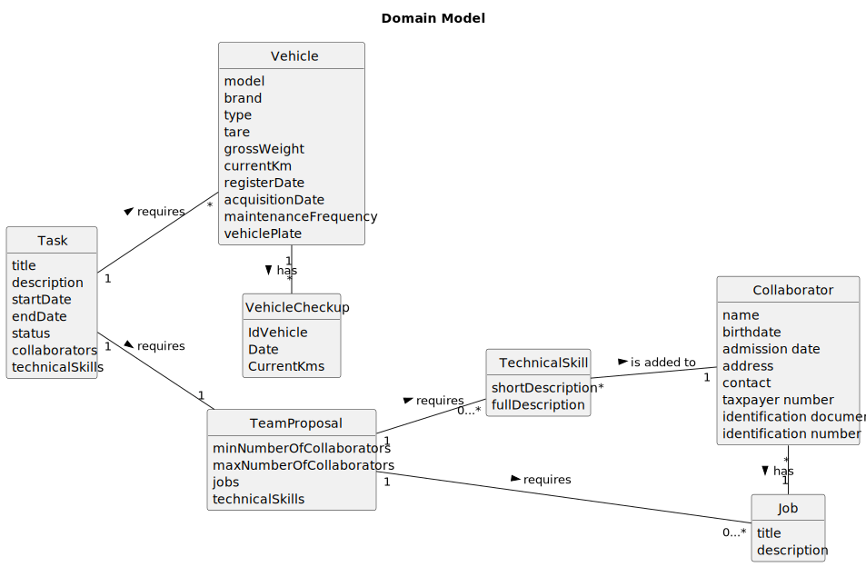

# OO Analysis

The construction process of the domain model is based on the client specifications, especially the nouns (for
_concepts_) and verbs (for _relations_) used.

## Rationale to identify domain conceptual classes

To identify domain conceptual classes, start by making a list of candidate conceptual classes inspired by the list of
categories suggested in the book "Applying UML and Patterns: An Introduction to Object-Oriented Analysis and Design and
Iterative Development".

### _Conceptual Class Category List_

**Business Transactions**

* Planning
* Construction
* Maintenance

---

**Transaction Line Items**

* Plant material
* Urban furniture
* Irrigation Systems and drinking fountains
* Lighting systems and power supply
* Drainage systems

---

**Product/Service related to a Transaction or Transaction Line Item**

* Tasks
* Teams

---

**Transaction Records**

* Agenda
* Checkup Register
* Work Log

---  

**Roles of People or Organizations**

* Human Resources Manager - HRM
* Fleet Manager - VFM
* Vehicle and Equipment Crew Manager
* Collaborator
* Green Spaces Manager - GSM
* Green Spaces User - GSU

---

**Places**

* Garden
* Medium-sized park
* Large-sized park

---

**Noteworthy Events**

* Team Formation
* CheckUp
* Registering, Listing, Generating, Assigning.

---

**Physical Objects**

* Vehicles
* Equipment
* Machines

---

**Descriptions of Things**

* Skills set
* Job Descriptions

---

**Catalogs**

* Skills Catalog
* Vehicle Catalog
* Model Catalog

---

**Containers**

* Team
* Task
* Collaborator
* Vehicle

---

**Elements of Containers**

* Team Members
* Skills
* Job
* Brand, Type, Model, CheckUp
---

**Organizations**

* MusgoSublime - MS

---

**Other External/Collaborating Systems**

* User Portal

---

**Records of finance, work, contracts, legal matters**

* Admission date

---

**Financial Instruments**

* None

---

**Documents mentioned/used to perform some work/**

* Reports
* Documents

---

## Rationale to identify associations between conceptual classes

An association is a relationship between instances of objects that indicates a relevant connection and that is worth of
remembering, or it is derivable from the List of Common Associations:

- **_A_** is physically or logically part of **_B_**
- **_A_** is physically or logically contained in/on **_B_**
- **_A_** is a description for **_B_**
- **_A_** known/logged/recorded/reported/captured in **_B_**
- **_A_** uses or manages or owns **_B_**
- **_A_** is related with a transaction (item) of **_B_**
- etc.

| Concept (A) 		   |   Association   	    |            Concept (B) |
|------------------|:--------------------:|-----------------------:|
| Employee         |       creates        |                   Task |
| Task             |     cataloged as     |               Category |
| Category         |       requires       |         TechnicalSkill |
| TechnicalSkill   |     regarding an     |           ActivityArea |
| Employee         |      registers       |         TechnicalSkill |
| TechnicalSkill   |     is added to      |           Collaborator |
| Employee         |      registers       |                Vehicle |
| Vehicle          |         has          |   Brand/VehicleCheckup |
| Employee         |      registers       |         VehicleCheckup |
| Employee         |      registers       |                    Job |
| Job              |       assigned       |           Collaborator |
| Employee         |      registers       |           Collaborator |

## Domain Model

**Do NOT forget to identify concept atributes too.**

**Insert below the Domain Model Diagram in a SVG format**

