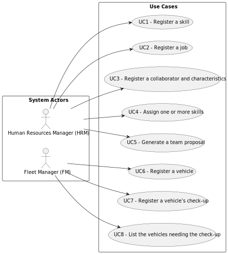

# User Manual

### [Glossary](01.requirements-engineering/glossary.md)

## Introduction
The user manual contains information on how to use and operate the application developed. It has a glossary that explains some of the more complex terms as well as some system features explained to contribute to the better understanding of the application. This also specifies the features of the application and has a list of possible situations that might help the user identify and solve various issues that may occur while using the application.

To support the activity of MusgoSublime, our application pretends to help in the planning, construction and maintenance of green spaces for collective use.
### Purpose and Scope

## System Overview

### Objectives

MusgoSublime is an organization dedicated to the planning, construction and maintenance of green spaces for collective use in their multiple dimensions.

EcoSphere is a robust solution crafted to streamline and optimize the oversight of natural environments and help MusgoSublime.

Its main goals are centered on fostering efficient organization, upkeep, and improvement of green areas, with a focus on ensuring their well-being and long-term viability. For that it creates a team with various collaborators with different skills and jobs, assigning tasks and improving regular check-ups.

### Structure

The application is structured into distinct modules, each tailored to fulfill specific functions while remaining interconnected to deliver a seamless user experience.
* Dashboard: The central hub where users can access key metrics, notifications, and quick links to various functions.
* Inventory Management: Allows users to catalog and track resources such as plants, tools, equipment, and materials essential for green space maintenance.
* Task Management: Enables users to create, assign, and track tasks related to maintenance activities, ensuring efficient allocation of resources and timely completion of assignments.
* Reporting and Analytics: Provides comprehensive reporting functionalities, including data analysis tools to monitor the health and performance of green spaces over time.
* Communication: Facilitates communication and collaboration among team members.
* Documentation: Stores essential documents, manuals, guidelines, and references relevant to green space management for easy access and reference.

### Main Features

* Inventory tracking and management
* Task assignment and tracking
* Reporting and analytics
* Communication tools
* Document storage and access

### Diagram

## Features/Functions

###  1. Register a skill | Human Resources Manager

This feature allows the Human Resources Manager (HRM) to register a skill to the system.

#### Step by step

1. Open the HRM system.
2. Select the option to register a skill.
3. Input the skill name and description.
4. Confirm the data.

### 2. Register a job | Human Resources Manager

This feature allows the Human Resources Manager (HRM) to add a job to the system

### Step by step
1. Open the HRM system.
2. Select the option to register a job.
3. Input the job name and description.
4. Confirm the data.

### 3. Register a collaborator and characteristics | Human Resources Manager

This features provides the HRM the ability to register a collaborator with job-related information and characteristics.

#### Step by step

1. Log in to the HRM system.
2. Access the section for creating a new collaborator.
3. Choose to create a new collaborator.
4. Enter the requested data for the new collaborator with personal information and job details.
5. Upon inputting the data, the system will present all entered information for a review. Review the entered information.
6. Confirm the provided data by selecting the appropriate option on the collaborator.
7. Upon confirmation, the system will display a success message confirming the creation of new collaborator.

### 4. Assign one or more skills | Human Resources Manager

This feature allows the Human Resources Manager (HRM) to add one or more skills to a collaborator.

#### Step by step
1. Open the HRM system.
2. Select the option to add one or more skills to a collaborator.
3. Select the skills
4. Select the collaborator
5. Confirm the data

#### Step by step

### 5. Generate a team proposal | Human Resources Manager

This feature allows the Human Resources Manager (HRM) to generate a team proposal automatically for a task.

### Step by step
1. Open the HRM system.
2. Select the option to generate a team proposal
3. Select the required skills
4. Select the required jobs
5. Select the minimum and maximum amount of collaborators
6. Confirm the data
7. Accept or refuse the team proposal

#### Step by step

### 6. Register a vehicle | Human Resources Manager

This feature allows the FM (Fleet Manager) to register a new vehicle and its characteristics in the system.

#### Step by step
1. Log into the system as an FM.
2. Navigate to the vehicle registration section.
3. Choose to register a new vehicle.
4. Fill in the form with the necessary vehicle information.
5. Confirm the entered data.

### 7. Register a Vehicle's Check-up | Fleet Manager

This feature allows the Fleet Manager (FM) to register a vehicle's check-up, capturing details such as the vehicle's ID, date of the check-up, and current kilometers.

#### Step by step

1. Open the FM system.
2. Access the vehicle check-up registration section.
3. Choose the vehicle for check-up registration.
4. Input the date of the check-up and the current kilometers.
5. Review the entered information.
6. Confirm the check-up registration.

## 8. List the vehicles needing the check-up | Fleet Manager

This feature allows the Fleet Manager (FM) to list vehicles requiring a check-up, presenting relevant information about each vehicle, such as its model, brand, type, tare weight, gross weight, current kilometers, registration date, acquisition date, maintenance frequency, and vehicle plate.

#### Step by step

1. Open the FM system.
2. Navigate to the section for listing vehicles needing a check-up.
3. Select the option to list vehicles.
4. Review the displayed list of vehicles requiring a check-up, along with their associated details.
5. Receive information about the vehicles and their check-up status.