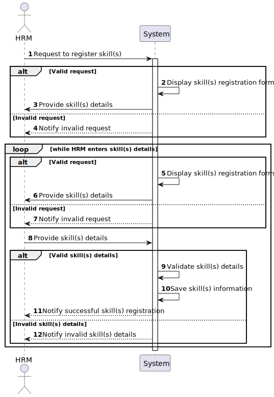

# US001 - Register a skill

## 1. Requirements Engineering

### 1.1. User Story Description

As a Human Resources Manager (HRM), I want to register skills that a collaborator may have.

### 1.2. Customer Specifications and Clarifications 

**From the specifications document:**

>	A newly developed skill needs to be stored within a list of skills for future reference, allowing for its assignment to one or multiple workers later on.

**From the client clarifications:**

> **Question:** Do I need to add skills  by writing them or can I just give a file with all of the skills?
>
> **Answer:** Both are acceptable since the business the same the crucial difference resides in the UX.

> **Question:** Does the HRM need to see the confirmation of the success of the operation and the skills added or just the success of the operation?
>
> **Answer:** It will depend if you opt to insert one skill or a set of skills in a batch. Maybe some adaptation needed.

> **Question:** Is there any other possible outcome like if the HMR does not put the requested data, do I need to ask the user to register a different competence?
> 
> **Answer:** This US is quite simple, atm a skill is simply a name.

> **Question:** Which information can be introduced to create a new skill?
>
> **Answer:** The name of the skill.

> **Question:** Which information is mandatory for creating a new skill?
>
> **Answer:** The name of the skill.

> **Question:** Which are the skills accepted? Or should we enable the HRM to introduce anything as a skill?
>
> **Answer:** All, it's up to HRM to decide. (special characters or algarisms should not be allowed in the skill name)

> **Question:** What criteria is necessary to register a skill?
>
> **Answer:** The skill name, for example: Pruner, Heavy vehicle driver, 

> **Question:** The indentificator of the skill will be the name, or the system will generate authomatically and Id when the manager insert the name?
> 
> **Answer:** A skill is just a name, can be a composition os words like "Light Vehicle Driving Licence".
>I have no knowledge about systems IDs.

> **Question:** which is the difference between collaborator and employ? And employ could have skills? HRM, VFM, GSM and GSU are employers?
>
> > **Answer:** Employee and collaborator are synonyms.

> **Question:** Should the system able the HRM to introduce multiple skills in one interaction before saving all of them?
> 
> **Answer:** it's not required to do so.
 

### 1.3. Acceptance Criteria

* **AC1:** All required fields must be filled in.
* **AC2:** The task reference must have at least 5 alphanumeric characters.
* **AC3:** When creating a skill with an existing reference, the system must reject such operation and the user must be able to modify the typed reference.

### 1.4. Found out Dependencies

None.

### 1.5 Input and Output Data

**Input Data:**

* Typed data:
    * a designation 

* Selected data:
    * none

**Output Data:**

* List of existing task categories
* (In)Success of the operation

### 1.6. System Sequence Diagram (SSD)

#### Alternative One

### 1.7 Other Relevant Remarks
