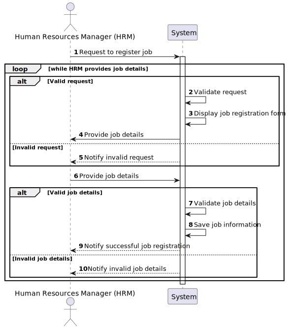

# US002 - Register a job 

## 1. Requirements Engineering

### 1.1. User Story Description

As an HRM, I want to register a job that a collaborator need to have.

### 1.2. Customer Specifications and Clarifications 

**From the specifications document:**

>	Each task is characterized by having a unique reference per organization, a designation, an informal and a technical description, an estimated duration and cost, as well as a task category. 

>	As long as it is not published, access to the task is exclusive to the employees of the respective organization. 

**From the client clarifications:**

> **Question:**  What are the input data for creating a profession?
>
> **Answer:** The name of the profession: Gardener, Paver, Electrician, Operator, ...

> **Question:** What is the acceptance criteria when are creating a job that already exists and what does the system do?
>
> **Answer:** By definition a set can´t have duplicates. Assuring no duplicates is not a business rule is a technical issue.

> **Question:** Is it relevant to associate a specific area or sector with each Job? (For example, "Gardener" would be inserted in the "Maintenance" sector)
> 
> **Answer:**  it is not necessary to the extent that there are no US to suggest that it might ever be necessary

> **Question:** Should you include information such as salary, type of hire (full-time or part-time), and type of work (face-to-face, remote or hybrid) in the Job? Or does this information fit better within the scope of the employee, or maybe it's not even necessary?
>
> **Answer:** idem

> **Question:** What other information do you think you need to associate with the Job?
>
> **Answer:** for now none

> **Question:** Can special characters and numbers be entered when registering a job?
>
> **Answer:** no;

> **Question:** I assume that a job name cannot be empty. Is that right?
>
> **Answer:** that's right

> **Question:** For registering a job into system manager needs to type just "Job tilte" ?
>we do not need other attributes such as below:
>1. Job ID, for identifying each job from Administration prespective.
>2. Job category : for classifying jobs like gardening, drivers, administration employees , etc
>3. Job Skills: for assigning qualified employee/collaborator in future (having same qualities and skills)
>or other attributes...
>
> **Answer:** I'll repeat:
>a job is just the job name!
>1. Don't know what means job ID, because in the client perspective, a job is just the job name;
>2. there is no job category;
>3. There is the concept of skill but not directly related (atm) with job;

> **Question:** After register a job/vehicle's checkup should a message (sucess or failure) or a resume of the register appear?
>
> **Answer:** the UX/UI is up to dev teams.

> **Question:** Should we add a description or anything atribute for the Job registration? 
> 
> **Answer:** not need to, job is just a name;

> **Question:** The id of Job is generated authomatically by the system?
> 
> **Answer:** don't know what is job id, job is just a name;

> **Question:** I guess a job can be asign to a collaborator if he has the skills require for this job. How do we manage this relation. Does he HRM do it manually, or should we have an atribute in job specifiying the skills needed.
> 
> **Answer:** no; a colaborator is hired for a job and can have skills or not;

> **Question:** Do the job has to be register before registering a collaborator?
> 
> **Answer:** a colaborator is hired for a (valid) job;

> **Question:** When we register a team, the collaborators has to have a job?
> 
> **Answer:**  see the previous 2 questions/answers;

> **Question:** What do you want to see as an output?
> 
> **Answer:** the UX/UI is to be decided by dev team.
 

### 1.3. Acceptance Criteria

* **AC1:** All required fields must be filled in.
* **AC2:** The task reference must have at least 5 alphanumeric characters.
* **AC3:** When creating a task with an existing reference, the system must reject such operation and the user must be able to modify the typed reference.

### 1.4. Found out Dependencies

* There is a dependency on "US003 - Create a task category" as there must be at least one task category to classify the task being created.

### 1.5 Input and Output Data

**Input Data:**

* Typed data:
    * a reference
    * a designation 
    * an informal description
    * a technical description
    * an estimated duration
    * an estimated cost
	
* Selected data:
    * a task category 

**Output Data:**

* List of existing task categories
* (In)Success of the operation

### 1.6. System Sequence Diagram (SSD)

#### Alternative One

