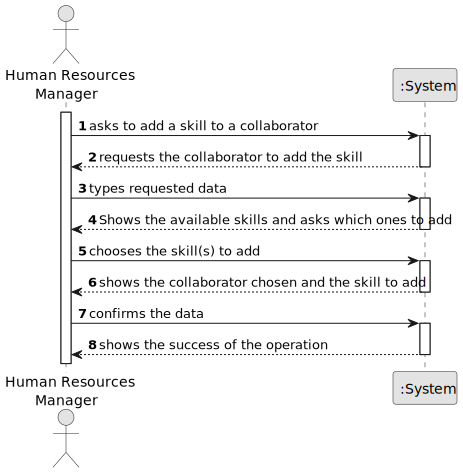

# US006 - Create a Task

## 1. Requirements Engineering

### 1.1. User Story Description

As an HRM, I want to assign one or more skills to a collaborator.

### 1.2. Customer Specifications and Clarifications

**From the specifications document:**

> Each collaborator must have a unique id

> Using the id, the user must choose the collaborator and add a skill

**From the client clarifications:**

> **Question:** Can any skill be registered to any collaborator/job? Or should they be associated in categories in
> association with a specific job?

> **Answer:** There is no association, it totally depends on the CV of the collaborator.

> **Question:** Should it be possible to add the same skill to a collaborator multiple times?

> **Answer:** That does not make sense.

> **Question:** Is there any certification/proof needed to register a skill to a collaborator?

> **Answer:** no.
 
> **Question:** Is there any limit of skills or a minimum number of skills?

> **Answer:** No.

> **Question:** Is there any special characteristic to be able to add a skill to a collaborator?

> **Answer:** No.

### 1.3. Acceptance Criteria

* **AC1:** All required fields must be filled in.
* **AC2:** If the collaborator doesn't exist the system must let the user re-choose the collaborator
* **AC3** If the collaborator already has the skill chosen, the user must be alerted, and the operation aborted.

### 1.4. Found out Dependencies

* There is a dependency on "US003 - As an HRM, I want to register a collaborator with a job and fundamental
  characteristics." - there has to be at least one collaborator to be assigned a skill

### 1.5 Input and Output Data

**Input Data:**

* Typed data:
    * The collaborator
    * The skill

**Output Data:**

* All the skills of the collaborator
* (In)Success of the operation

### 1.6. System Sequence Diagram (SSD)

**_Other alternatives might exist._**

#### Alternative One

### 1.7 Other Relevant Remarks

* The user can always choose a different person to add the skill in case he makes a mistake