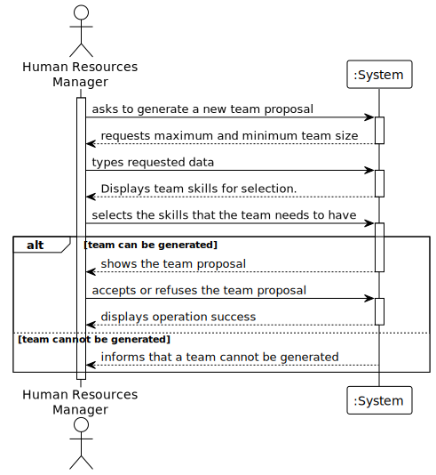

# US005 - Generate a team proposal

## 1. Requirements Engineering

### 1.1. User Story Description

As a HRM, I want to generate a team proposal automatically.

### 1.2. Customer Specifications and Clarifications

**From the specifications document:**

> The HRM can generate a team proposal automatically.

> The HRM must specify the team size and the skills needed.

**From the client clarifications:**

> **Question:** I would to know which business rules apply for the input data to generate a team proposal.
>
> **Answer:** Max and min team size, and a list of skills needed.

> **Question:** I would like to ask if, in this US, there should be any more information in the team generated beyond
> the collaborators in which it consists?
>
> **Answer:** The information shouldd contain each of team members and the its skills.

> **Question:** I would also like to know if a collaborator can be in more than one team at the same time?
>
> **Answer:** No.

> **Question:** What information will the customer provide?
>
> **Answer:** The customer provide the max size of the team and a set of skills.

> **Question:** What should the output of the automation be? (should it just store the team proposal or show it to the
> customer?)  Will the team proposal be a document about all the instructions of each team member/worker?
>
> **Answer:** The systems provide team proposals and HRM can accept of refuse the proposals. In the future (not in this
> sprint) HRM may decide to edit the team.

> **Question:** How does it generate the team if there are not enough employees?
>
> **Answer:** The system should provide information why it can't generate a team.

> **Question:** How does he propose a team, for what purpose? (Is there any predefinition)?
>
> **Answer:** There is no purpose, at least in this sprint.

> **Question:** What are the input data to automatically generate a team?
>
> **Answer:** the max size of the team (for instance 4)
> and the skill needed: 4 tree pruner and 1 light vehicle driver
> meaning that one team member have 2 skills.

> **Question:** Are the skills(input) typed or selected. 
> Does the output show the team members with or without their skills?
>
> **Answer:** The ux/ui is up to the dev team.

> **Question:** I would to know which business rules apply for the input data to generate a team proposal.
>
> **Answer:** max and min team size, and a a list of skills needed.
> For instance:
> min: 3
> max: 4

> **Question:** Can a collaborator have no skills assigned?
>
> **Answer:** Yes.

### 1.3. Acceptance Criteria

* **AC1:** The HRM must provide the minimum and maximum team size and the necessary skills.
* **AC2:** If the system cannot generate a team, it must inform the HRM.
* **AC3:** The system must propose a team that meets the criteria.
* **AC4:** The HRM must be able to accept or refuse the proposed team.
* **AC5:** In case of error, it should be displayed to the HRM in a user-friendly manner.

### 1.4. Found out Dependencies

* There is a dependency on "US003 - As an HRM, I want to register a collaborator with a job and fundamental
  characteristics." as there must be at least one collaborator to be chosen for the team.
* There is a dependency on "US004 - As an HRM, I want to assign one or more skills to a collaborator." - as there must
  be a way to update the collaborator's skills so that the system can create the best team possible.

### 1.5 Input and Output Data

**Input Data:**

* Typed data:
    * The maximum team size
    * The minimum team size
    * The skills needed

* Selected data:
    * The Collaborators

**Output Data:**

* (In)Success of the operation
* The proposed team

### 1.6. System Sequence Diagram (SSD)

#### Alternative One

### 1.7 Other Relevant Remarks

* The teams are temporary, and the collaborators can be assigned to different teams in the future.
* The HRM can refuse to accept the proposed team.
