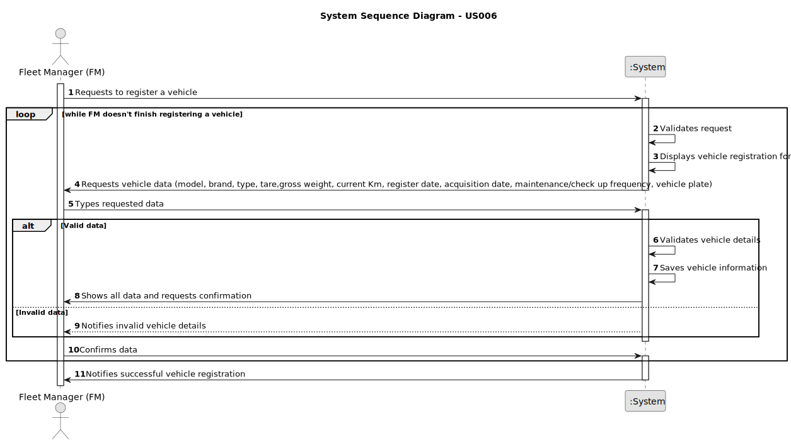

# US006 - Register a vehicle

## 1. Requirements Engineering

### 1.1. User Story Description

The customer requires the application to enable employees with the FM function to register vehicles in the system. Vehicle registration will be conducted through a form that will only accept submissions if all parameters are filled with valid values.

### 1.2. Customer Specifications and Clarifications 

**From the specifications document:**

> The brand, model, type, tare, gross weight, current Km, register date, acquisition date and maintenance frequency (in Kms) of the vehicle must be indicated.
>

> All values must be entered by the FM
> 

**From the client clarifications:**

> **Question:** Can a fm register no vehicles or does he have to register at least one?
> 
> **Answer:** The VFM is a role or system user profile that has the rights to perform some system actions (like the ones described by the US06, US07 and US08).
In theory If there is no need to register a vehicle, no vehicles will be registered but that would be rather odd.

> **Question:** When a vehicle is registered, are there specific requirements for accepting the brand? For example, does the system need to check if the brand is on a predetermined list? Does this also apply to the model or any other characteristics?
>
> **Answer:** No one can consider a list os brands and a list of models previously inserted in the system, no need to go through validations.

> **Question:** For the application to work does the FM need to fill all the attributes of the vehicle?
>
> **Answer:** Yes, besides the vehicle plate that by mistake doesn't appear on the text. 

> **Question:** Should the application identify a registered vehicle by a serial number or other attribute?
>
> **Answer:** By plate id.

> **Question:** Should the application a group the vehicles by their brand, serial number or other attribute?
>
> **Answer:** No requirements were set concerning groups of vehicles.

> **Question:** If the Fm inserts the same vehicle by mistake, should it inform their user of the mistake and give him the option to add another vehicle?
>
> **Answer:** Again, duplication of data is not a business rule is technical one, since by definition in a set you cant have duplicates.

### 1.3. Acceptance Criteria

* **AC1:** All required fields must be filled in.
* **AC2:** The fields for Gross Weight, Current Kilometers, Tare, and Maintenance Frequency must be filled with integer values equal to or greater than zero.
* **AC3:** The license plate should only be accepted if it is a 6-character combination consisting of letters and numbers.
### 1.4. Found out Dependencies

* US006 has no dependencies.

### 1.5 Input and Output Data

**Input Data:**

* Typed data:
    * Brand
    * Model
    * Type
    * Tare (Kg)
    * Gross weight (Kg)
    * Current Km (Km)
    * Register date
    * Acquisition date
    * Maintenance frequency (Km)
    * Plate

**Output Data:**

* (In)Success of the operation
* List with the typed information

### 1.6. System Sequence Diagram (SSD)

**_Other alternatives might exist._**

### 1.7 Other Relevant Remarks

* The FM can also delete a registered vehicle.