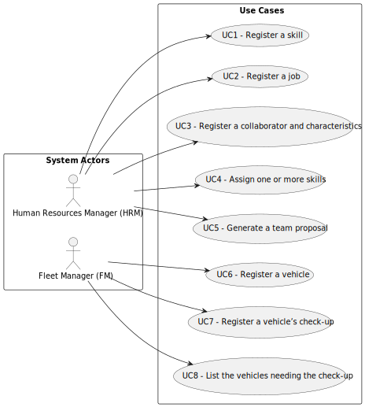

# Use Case Diagram (UCD)

**In the scope of this project, there is a direct relationship of _1 to 1_ between Use Cases (UC) and User Stories (US).**

However, be aware, this is a pedagogical simplification. On further projects and course units there may also exist _1 to N **and/or** N to 1_ relationships between UC and US.

**Insert below the Use Case Diagram in a SVG format**

**For each UC/US, it must be provided evidences of applying main activities of the software development process (requirements, analysis, design, tests and code). Gather those evidences on a separate file for each UC/US and set up a link as suggested below.**

# Use Cases / User Stories

| UC/US | Description                                                          |                   
|:------|:---------------------------------------------------------------------|
| US009 | [Register a skill](../../us009/Readme.md)                            |
| US010 | [Register a job](../../us010/Readme.md)                              |
| US011 | [Register a collaborator and characteristics](../../us011/Readme.md) |
| US012 | [Assign one or more skills](../../us012/Readme.md)                   |
| US013 | [Generate a team proposal](../../us013/Readme.md)                    |
| US014 | [Register a vehicle](../../us014/Readme.md)                          |
