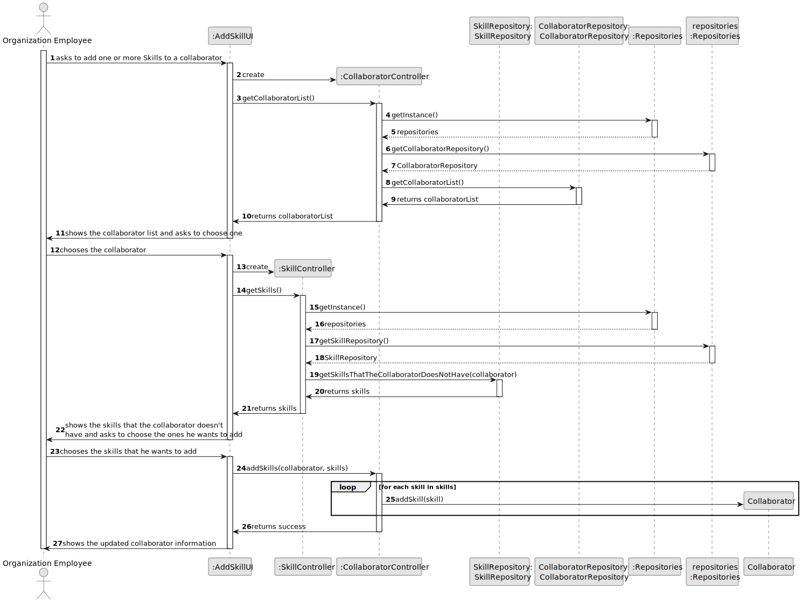

# US004 - Add a skill to a collaborator

## 3. Design - User Story Realization

### 3.1. Rationale

| Interaction ID                                                      | Question: Which class is responsible for...                  | Answer                 | Justification (with patterns)                                                                                 |
|:--------------------------------------------------------------------|:-------------------------------------------------------------|:-----------------------|:--------------------------------------------------------------------------------------------------------------|
| Step 1: asks to assign one or more skills to a collaborator  		     | 	... interacting with the actor?                             | AddSkillUI             | Pure Fabrication: there is no reason to assign this responsibility to any existing class in the Domain Model. |
| 			  		                                                             | 	... coordinating the US?                                    | AddSkillUI             | Pure Fabrication: there is no reason to assign this responsibility to any existing class in the Domain Model. |
| Step 2: Shows the list of collaborators  		                         | 		... interacting with the actor?					                       | AddSkillUI             | Pure Fabrication: there is no reason to assign this responsibility to any existing class in the Domain Model. |
| Step 3: Choosing the collaborator  		                               | 	... interacting with the actor?                             | AddSkillUI             | Pure Fabrication: there is no reason to assign this responsibility to any existing class in the Domain Model. |
|                                                                     | ... getting the collaborator list                            | CollaboratorRepository | IE: its the repository that stores the collaborator's information's                                           |
|                                                                     | ... accessing the repository to get the collaborator list    | CollaboratorController | IE: its the controller with access to the collaborator repository                                             |
| Step 4: shows the list of skills to assign to that collaborator  		 | 	...interacting with the actor?                              | AddSkillUI             | Pure Fabrication: there is no reason to assign this responsibility to any existing class in the Domain Model. |
| 			  		                                                             | 	... knowing the list of skills                              | SkillRepository        | IE: The repository keeps all the skills                                                                       |
|                                                                     | ... accessing the skill repository to get the list of skills | SkillController        | IE: its the controller that has access to the skill repository                                                |
| Step 5: Chooses one or more skills to add                           | 	... interacting with the actor?                             | AddSkillUI             | Pure Fabrication: there is no reason to assign this responsibility to any existing class in the Domain Model. |
|                                                                     | ... validate skill                                           | Skill                  | IE: Validates the skill before validating it                                                                  |
|                                                                     | ... saving the collaborator's skills                         | Collaborator           | IE: Manages collaborator's information                                                                        |
| Step 6: Displays operation success 		                               | ... interacting with the actor?							                       | AddSkillUI             | Pure Fabrication: there is no reason to assign this responsibility to any existing class in the Domain Model  |              

### Systematization ##

According to the taken rationale, the conceptual classes promoted to software classes are:

* SkillController
* CollaboratorController
* Collaborator
* Skill
* CollaboratorRepository
* SkillRepository

Other software classes (i.e. Pure Fabrication) identified:

* AddSkillUI

## 3.2. Sequence Diagram (SD)

### Full Diagram

This diagram shows the full sequence of interactions between the classes involved in the realization of this user story.

### Split Diagrams

The following diagram shows the same sequence of interactions between the classes involved in the realization of this
user story, but it is split in partial diagrams to better illustrate the interactions between the classes.

It uses Interaction Occurrence (a.k.a. Interaction Use).

## 3.3. Class Diagram (CD)

