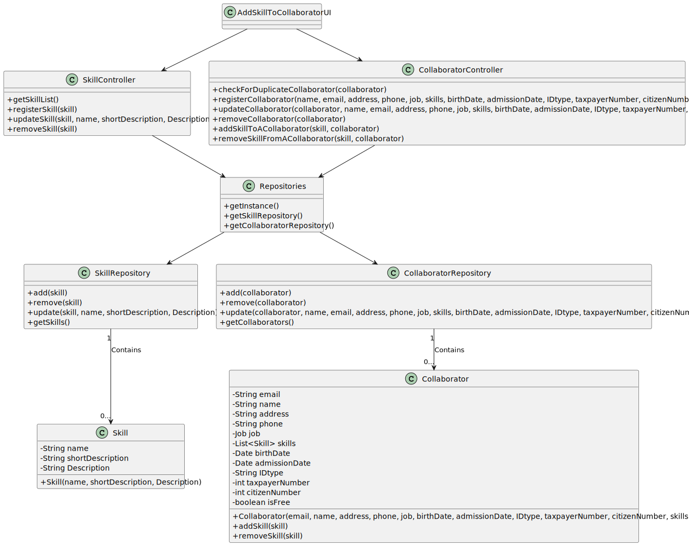

# US004 - Add a skill to a collaborator

## 3. Design - User Story Realization

### 3.1. Rationale

| Interaction ID                                                      | Question: Which class is responsible for... | Answer             | Justification (with patterns)                                                                                 |
|:--------------------------------------------------------------------|:--------------------------------------------|:-------------------|:--------------------------------------------------------------------------------------------------------------|
| Step 1: asks to assign one or more skills to a collaborator  		     | 	... interacting with the actor?            | AddSkillUI         | Pure Fabrication: there is no reason to assign this responsibility to any existing class in the Domain Model. |
| 			  		                                                             | 	... coordinating the US?                   | AddSkillController | Controller                                                                                                    |
| 			  		                                                             | 	... knowing the list of skills             | SkillRepository    | IE: Pure Fabrication                                                                                          |
| 			  		                                                             | ... knowing the user using the system?      | UserSession        | IE: cf. A&A component documentation.                                                                          |
| 			  		                                                             | 							                                     | Organization       | IE: knows/has its own Employees                                                                               |
| 			  		                                                             | 							                                     | Employee           | IE: knows its own data (e.g. email)                                                                           |
| Step 2: Shows the list of collaborators  		                         | 		... interacting with the actor?					      | AddSkillUI         | Pure Fabrication: there is no reason to assign this responsibility to any existing class in the Domain Model. |
| Step 3: Choosing the collaborator  		                               | 	... interacting with the actor?            | AddSkillUI         | Pure Fabrication: there is no reason to assign this responsibility to any existing class in the Domain Model. |
|                                                                     | ... store the collaborator chosen?          | AssignSkillUI      | Pure Fabrication: there is no reason to assign this responsibility to any existing class in the Domain Model. |
| Step 4: shows the list of skills to assign to that collaborator  		 | 	...interacting with the actor?             | AssignSkillUI      | Pure Fabrication: there is no reason to assign this responsibility to any existing class in the Domain Model. |
| Step 5: Chooses one or more skills to add                           | 	... interacting with the actor?            | AssignSkillUI      | Pure Fabrication: there is no reason to assign this responsibility to any existing class in the Domain Model. |
|                                                                     | ... validate skill                          | Organization       | IE: owns its data.                                                                                            |
|                                                                     | ... adding skill                            | Organization       | IE: owns its data.                                                                                            |
|                                                                     | ... saving the collaborator's skills        | Organization       | IE: knows all its collaborators.                                                                              |
| Step 6: Displays operation success 		                               | ... interacting with the actor?							      | Assign skill UI    | Pure Fabrication: there is no reason to assign this responsibility to any existing class in the Domain Model  |              

### Systematization ##

According to the taken rationale, the conceptual classes promoted to software classes are:

* Organization
* Skill

Other software classes (i.e. Pure Fabrication) identified:

* AddSkillUI
* AddSkillController

## 3.2. Sequence Diagram (SD)

### Full Diagram

This diagram shows the full sequence of interactions between the classes involved in the realization of this user story.

### Split Diagrams

The following diagram shows the same sequence of interactions between the classes involved in the realization of this
user story, but it is split in partial diagrams to better illustrate the interactions between the classes.

It uses Interaction Occurrence (a.k.a. Interaction Use).

**Get Skill List**

**Get Employee**

**Add Skill**

## 3.3. Class Diagram (CD)

