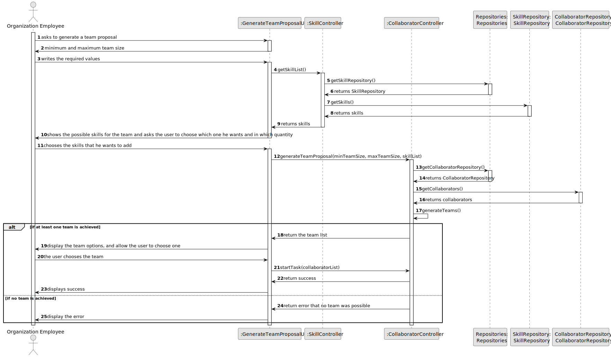
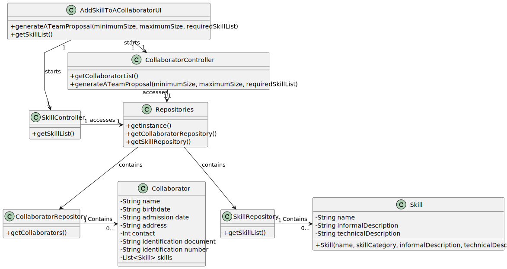

# US006 - Create a Task

## 3. Design - User Story Realization

### 3.1. Rationale

| Interaction ID                                                                             | Question: Which class is responsible for... | Answer                 | Justification (with patterns)                                                                                 |
|:-------------------------------------------------------------------------------------------|:--------------------------------------------|:-----------------------|:--------------------------------------------------------------------------------------------------------------|
| Step 1: actor asks to generate a team proposal  		                                         | 	... interacting with the actor?            | GenerateTeamUI         | Pure Fabrication: there is no reason to assign this responsibility to any existing class in the Domain Model. |
| 			  		                                                                                    | 	... coordinating the US?                   | GenerateTeamUI         | Pure Fabrication: there is no reason to assign this responsibility to any existing class in the Domain Model. |
| Step 2: system asks for the maximum and minimum size of the team  		                       | ... interacting with the actor?							      | GenerateTeamUI         | Pure Fabrication: there is no reason to assign this responsibility to any existing class in the Domain Model  |
| Step 3: actor writes the requested data  		                                                | 	... saving the inputted data?              | GenerateTeamUI         | Pure Fabrication: there is no reason to assign this responsibility to any existing class in the Domain Model  |
| Step 4: system fetches the skill list  		                                                  | 	... fetching the data?                     | SkillController        | IE: Its the controller that manages the Skills                                                                |
| Step 5: system asks which skills the team needs to have  		                                | 	...  interacting with the actor?           | GenerateTeamUI         | Pure Fabrication: there is no reason to assign this responsibility to any existing class in the Domain Model  |
| Step 6: actor chooses the requested skills  		                                             | 			...saving the selected skills?				       | GenerateTeamUI         | Pure Fabrication: there is no                                                                                 |              
| Step 7: system fetches the collaborator list and generates the possible team proposals  		 | 	... fetching the collaborator list?        | CollaboratorController | IE: its the controller that manages the collaborators                                                         | 
| 			  		                                                                                    | 	... forming all the possible teams?        | CollaboratorController | IE: its the controller that manages the collaborators                                                         | 
| Step 8: system displays the team proposals and asks the user to choose one   		            | 	... interacting with the actor?            | GenerateTeamUI         | Pure Fabrication:  there is no reason to assign this responsibility to any existing class in the Domain Model |
| Step 9: actor chooses one team   		                                                        | 	... saving the inputted data?              | GenerateTeamUI         | Pure Fabrication: there is no reason to assign this responsibility to any existing class in the Domain Model  |
| Step 10: system updates the task availability for each member of the team   		             | 	... updating the collaborator's status?    | CollaboratorController | IE: its the controller that manages the collaborators                                                         |
|                                                                                            | ... displaying operation's success?         | GenerateTeamUI         | Pure Fabrication: there is no reason to assign this responsibility to any existing class in the Domain Model  |

### Systematization ##

According to the taken rationale, the conceptual classes promoted to software classes are:

* Collaborator Controller
* SkillController

Other software classes (i.e. Pure Fabrication) identified:

* GenerateTeamUI

## 3.2. Sequence Diagram (SD)

### Full Diagram

This diagram shows the full sequence of interactions between the classes involved in the realization of this user story.

## 3.3. Class Diagram (CD)

