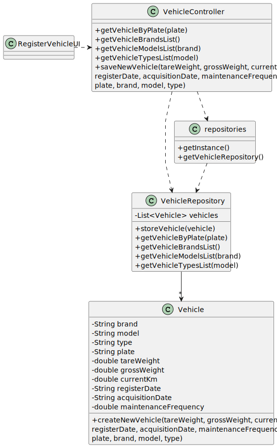

# US006 - Create a Task 

## 3. Design - User Story Realization 

### 3.1. Rationale

_**Note that SSD - Alternative One is adopted.**_

| Interaction ID                                    | Question: Which class is responsible for...                       | Answer                | Justification (with patterns)                                                                                 |
|:--------------------------------------------------|:------------------------------------------------------------------|:----------------------|:--------------------------------------------------------------------------------------------------------------|
| Step 1: asks to register a new vehicle            | interacting with the user?                                        | RegisterVehicleUi     | Pure Fabrication: there is no reason to assign this responsibility to any existing class in the Domain Model. |
|                                                   | coordinating the US?                                              | VehicleController     | Controller                                                                                                    |
| Step 2: asks for vehicle plate                    | asking for the new vehicle plate?                                 | RegisterVehicleUI     | IE: responsible for interacting with user.                                                                    |
| Step 3: types vehicle plate                       | comparing the new vehicle plate with the ones already registered? | Vehicle               |                                                                                                               |
|                                                   | temporarily keeping the typed data?                               | RegisterVehicleUI     |
| Step 4: asks for vehicle info 	                   | asking for the vehicle info?                                      | RegisterVehicleUI     | IE: responsible for interacting with user                                                                     |
| Step 5: types vehicle info                        | validating the vehicle info?                                      | RegisterVehicleUi     |                                                                                                               |
| Step 6: asks to select brand                      | asking to select a brand?                                         | VehicleAttributes     |                                                                                                               |
| Step 7: selects a brand                           | temporarily keeping the selected data?                            | RegisterNewEmployeeUI | IE: responsible for interacting with user.                                                                    |              
| Step 8: asks to select a model                    | asking to select a model?                                         | VehicleAttributes     |                                                                                                               | 
| Step 9: selects model                             | temporarily keeping the selected data?                            | RegisterNewEmployeeUI | IE: responsible for interacting with user.                                                                    | 
| Step 10: asks to select type                      | asking to select a type?                                          | VehicleAttributes     |                                                                                                               | 
| Step 11: selects type                             | temporarily keeping the selected data?                            | RegisterNewEmployeeUI | IE: responsible for interacting with user.                                                                    | 
| Step 12: shows all data and requests confirmation | showing all data and requesting confirmation?                     | RegisterNewEmployeeUI | IE: temporarily knows inputted data until user confirmation.                                                  | 
| Step 13: confirms data                            | saving all the data?                                              | Vehicle               |                                                                                                               | 
| Step 14: informs that vehicle was registered      | informing operation success?                                      | RegisterNewEmployeeUI | IE: responsible for interacting with user.                                                                    | 

### Systematization ##

According to the taken rationale, the conceptual classes promoted to software classes are: 

* Vehicle

Other software classes (i.e. Pure Fabrication) identified: 

* RegisterVehicleUI  
* VehicleController
* VehicleAttributes

## 3.2. Sequence Diagram (SD)

_**Note that SSD - Alternative Two is adopted.**_

### Full Diagram

This diagram shows the full sequence of interactions between the classes involved in the realization of this user story.

### Split Diagrams

None

## 3.3. Class Diagram (CD)

