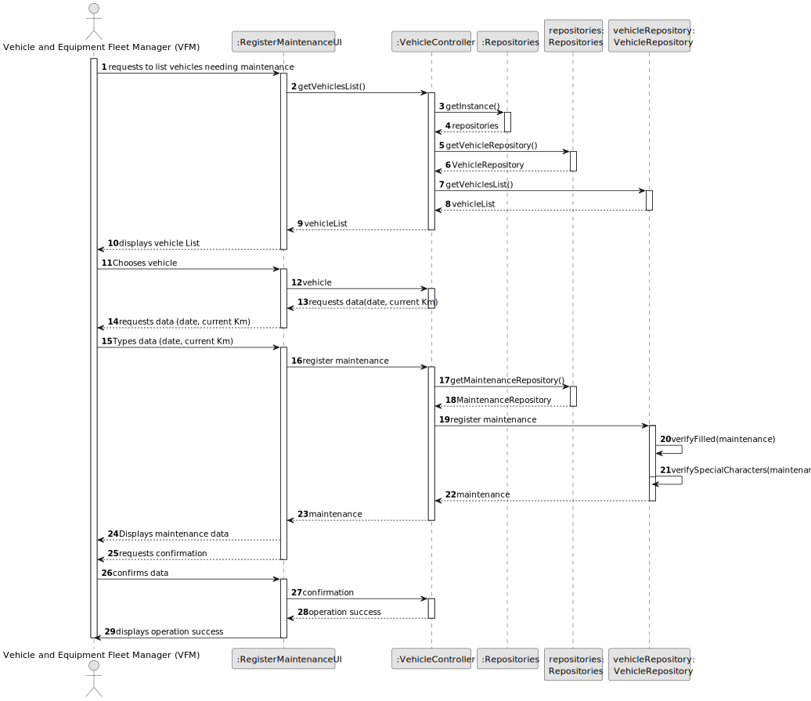

# US007 - Register a vehicle's check-up

## 3. Design - User Story Realization 

### 3.1. Rationale

_**Note that SSD - Alternative One is adopted.**_

| Interaction ID                                         | Question: Which class is responsible for...                 | Answer                        | Justification (with patterns) |
|:-------------------------------------------------------|:------------------------------------------------------------|:------------------------------|:------------------------------|
| Step 1: asks to register a vehicle's check-up 		       | 	... interacting with the actor?                            | RegisterMaintenanceUI         | Pure Fabrication              |
| 			  		                                                | 	... coordinating the US?                                   | RegisterMaintenanceController | Controller                    | 
| Step 2: shows all registered vehicles needing check-up | 	... ... providing the Vehicles needing check-up list?      | VehicleRepository             | Information Expert            |
|                                                        | 	... displaying the form containing the list of jobs?       | RegisterMaintenance           | Information Expert        |
| Step 3: selects a vehicle                              | 	... temporarily keeping the inputted data?                 | RegisterMaintenance           | Information Expert            |
| Step 4: requests data (idVehicle, date, currentKm)  		 | 	... displaying the form for the actor to input data?						 | RegisterMaintenance           | Information Expert            |
| Step 5: types requested data  		                       | 	... temporarily keeping the inputted data?                 | RegisterMaintenance           | Information Expert            |
| Step 6: shows all data and requests confirmation  		   | 	... displaying all information before submitting?          | RegisterMaintenance           | Information Expert            |
| 			  		                                                | 	... displaying the form for the actor to confirm?          | RegisterMaintenance           | Information Expert            |
| Step 7: confirms data  		                              | 	... instantiating a new check-up?                          | VehicleRepository             | Pure Fabrication              |
| 			  		                                                | 	... saving the inputted data?                              | Maintenance                   | Information Expert            |
| 			  		                                                | 	... validating the data locally (mandatory data)?          | Maintenance                   | Information Expert            |
| 			  		                                                | 	... validating the data globally (duplicate data)?         | Vehicle                       | Information Expert            |
| 			  		                                                | 	... saving the created check-up?                           | VehicleRepository             | Information Expert            |
| Step 8: displays operation success  		                 | ... informing operation success?                            | RegisterMaintenance           | Information Expert            |          

### Systematization ##

According to the taken rationale, the conceptual classes promoted to software classes are: 

* Maintenance

Other software classes (i.e. Pure Fabrication) identified: 

* RegisterMaintenanceUI
* RegisterMaintenanceController
* MaintenanceRepository
* VehicleRepository

## 3.2. Sequence Diagram (SD)

_**Note that SSD - Alternative Two is adopted.**_

### Full Diagram

This diagram shows the full sequence of interactions between the classes involved in the realization of this user story.

### Split Diagrams

The following diagram shows the same sequence of interactions between the classes involved in the realization of this user story, but it is split in partial diagrams to better illustrate the interactions between the classes.

It uses Interaction Occurrence (a.k.a. Interaction Use).

**Get Vehicles List**

**Create Maintenance**

## 3.3. Class Diagram (CD)

