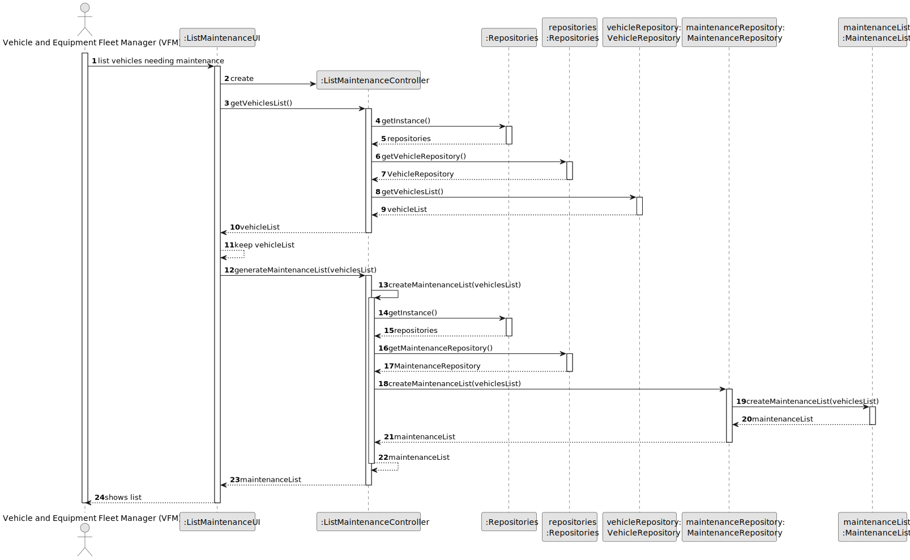
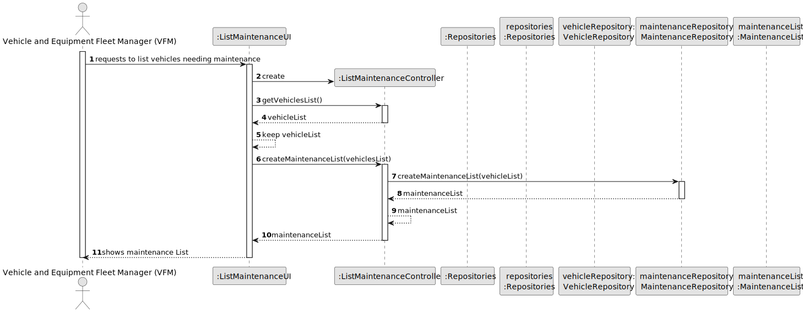
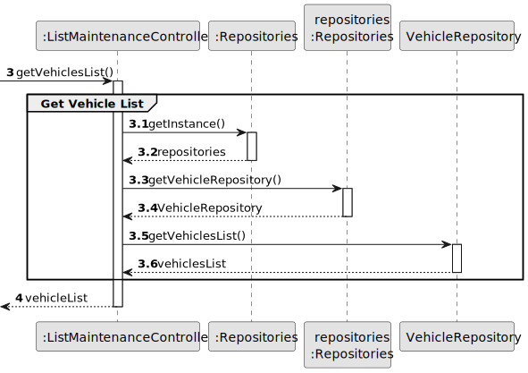
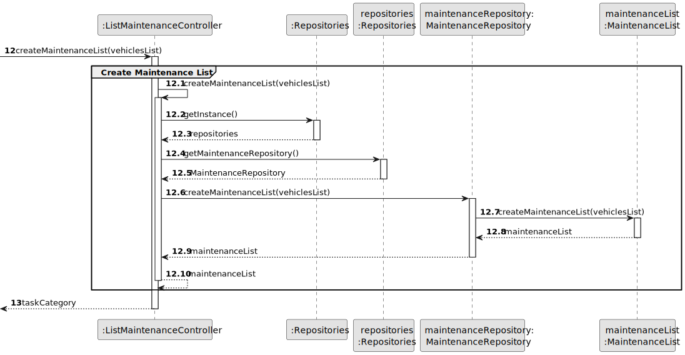
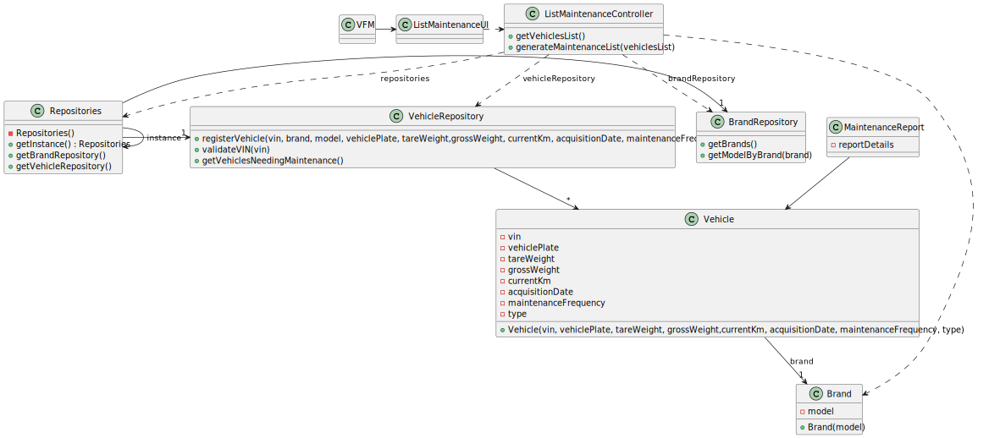

# US008 - List of the vehicles needing the check-up

## 3. Design - User Story Realization 

### 3.1. Rationale

_**Note that SSD - Alternative One is adopted.**_

| Interaction ID | Question: Which class is responsible for...         | Answer            | Justification (with patterns)                                                                                                                                                  |
|:---------------|:----------------------------------------------------|:------------------|:-------------------------------------------------------------------------------------------------------------------------------------------------------------------------------|
| Step 1         | ... interacting with the actor?                     | ListMaintenanceUI | Pure Fabrication: There is no need to assign this responsibility to any existing class in the Domain Model. The UI class is a utility class for handling user interaction.     |
|                | ... coordinating the US?                            | VehicleController | Controller: VehicleController is responsible for coordinating and controlling the flow of interaction between UI and domain classes, promoting low coupling and high cohesion. |
|                | ... handles the creation of the report?             | VehicleController | Controller: VehicleController manages the creation process, applying the Controller pattern by coordinating the interaction between UI and domain classes.                     |
|                | ... get VehicleRepository?                          | Repositories      | Pure Fabrication:                                                                                                                                                              |
|                | ... knowing the vehicles needing maintenance?       | VehicleRepository | IE: VehicleRepository possesses the logic for determining vehicles needing maintenance, based on predefined criteria, promoting high cohesion.                                 |
|                | ... Knowing last check-up of a vehicle?             | VehicleRepository | IE: VehicleRepository owns data of every vehicle that did a check-up.                                                                                                          |
|                | ... creating a maintenance list?                    | VehicleRepository | Creator: VehicleRepository which encapsulates the logic for managing maintenance reports.                                                                                      |
|                | ... validating all data (local validation)?         | MaintenanceList   | IE: MaintenanceList owns its data and is responsible for local validation of its attributes, ensuring data integrity and consistency.                                          | 
|                | ... validating all data (global validation)?        | VehicleRepository | IE: VehicleRepository performs global validation, often involving querying data from multiple sources to ensure data consistency.                                              | 
| Step 2         | ... informing created maintenance report?           | ListMaintenanceUI | Pure Fabrication: ListMaintenanceUI is responsible for informing users about the success of operations, promoting low coupling by encapsulating UI-related logic.              |

### Systematization ##

According to the taken rationale, the conceptual classes promoted to software classes are: 

* Vehicle
* VehicleCheckUp

Other software classes (i.e. Pure Fabrication) identified: 

* Repositories
* ListMaintenanceUI
* VehicleRepository

## 3.2. Sequence Diagram (SD)

_**Note that SSD - Alternative Two is adopted.**_

### Full Diagram

This diagram shows the full sequence of interactions between the classes involved in the realization of this user story.

### Split Diagrams

The following diagram shows the same sequence of interactions between the classes involved in the realization of this user story, but it is split in partial diagrams to better illustrate the interactions between the classes.

It uses Interaction Occurrence (a.k.a. Interaction Use).

**Get Vehicles List**

**Create Maintenance List**

## 3.3. Class Diagram (CD)

