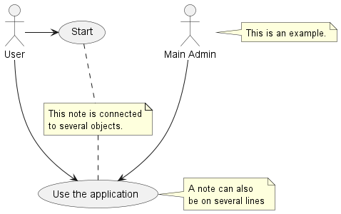

# US012 - Import a .csv file

## 1. Requirements Engineering

### 1.1. User Story Description

As a green space manager, I want to import a .csv file containing lines with information 
organized in this format: "Water Point X, Water Point Y, Distance," and transform it into 
a unified data structure.

### 1.2. Customer Specifications and Clarifications

**From the specifications document:**
>The set of imported lines describes all possible routes that can be opened to lay pipes 
between each pair of water points, and their respective installation costs.
> 

>The installation costs refer to the length, or to any other cost parameter.
>

**From the client clarifications:**

### 1.3. Acceptance Criteria

* **AC1** The number of parameters in the CSV file must be correct.
* **AC2** The names on the first line must be correct.
* **AC3** The csv file can't be empty.
### 1.4. Found out Dependencies
* None
### 1.5 Input and Output Data

**Input Data:**

* Typed data:
    * The absolute path to the csv file

**Output Data:**
* None

### 1.6. System Sequence Diagram (SSD)

### 1.7 Other Relevant Remarks
