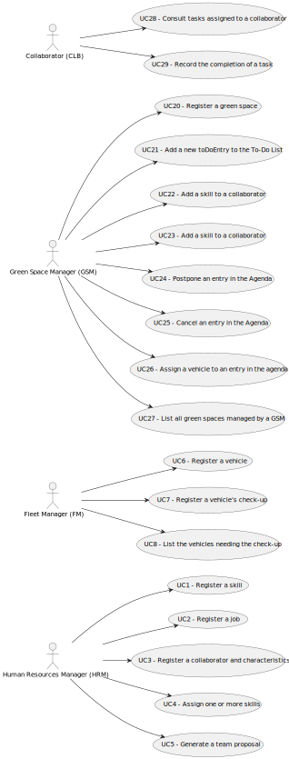

# Use Case Diagram (UCD)

**In the scope of this project, there is a direct relationship of _1 to 1_ between Use Cases (UC) and User Stories (US).**

The Use Case Diagram (UCD) below represents the main functionalities of the system.

The UCD is a visual representation of the system's functionalities, showing the interactions between the system and its users:

**For each UC/US, it must be provided evidences of applying main activities of the software development process (requirements, analysis, design, tests and code). Gather those evidences on a separate file for each UC/US and set up a link as suggested below.**

# Use Cases / User Stories

| UC/US | Description                                                                                       |                   
|:------|:--------------------------------------------------------------------------------------------------|
| US001 | [Register a skill](../../us001/Readme.md)                                                         |
| US002 | [Register a job](../../us002/Readme.md)                                                           |
| US003 | [Register a collaborator and characteristics](../../us003/Readme.md)                              |
| US004 | [Assign one or more skills](../../us004/Readme.md)                                                |
| US005 | [Generate a team proposal](../../us005/Readme.md)                                                 |
| US006 | [Register a vehicle](../../us006/Readme.md)                                                       |
| US007 | [Register a vehicle's check-up](../../us007/Readme.md)                                            |
| US008 | [List of the vehicles needing the check-up](../../us008/Readme.md)                                |
| US009 | [Perform a cost analysis](../../us009/Readme.md)                                                  |
| US010 | [See the used equipment](../../us010/Readme.md)                                                   |
| US011 | [Analyse the park by age groups](../../us011/Readme.md)                                           |
| US012 | [Import a .csv file](../../us012/Readme.md)                                                       |
| US013 | [Generate a team proposal](../../us013/Readme.md)                                                 |
| US014 | [Run tests for inputs of variable size](../../us014/Readme.md)                                    |
| US015 | [Predict the average monthly cost](../../us015/Readme.md)                                         |
| US016 | [Determine the best line that fits the data in US14.](../../us016/Readme.md)                      |
| US017 | [Place signs to evacuate park users](../../us017/Readme.md)                                       |
| US018 | [Place signs to evacuate park users to one of the several Assembly Points](../../us018/Readme.md) |
| US019 | [Run tests for inputs of variable size](../../us019/Readme.md)                                    |
| US020 | [Register a green space](../../us020/Readme.md)                                                   |
| US021 | [Add a new toDoEntry to the To-Do List](../../us021/Readme.md)                                    |
| US022 | [Add a skill to a collaborator](../../us022/Readme.md)                                            |
| US023 | [Add an entry to the Agenda](../../us023/Readme.md)                                               |
| US024 | [Postpone an entry in the Agenda](../../us024/Readme.md)                                          |
| US025 | [Cancel an entry in the Agenda](../../us025/Readme.md)                                            |
| US026 | [Assign a vehicle to an entry in the agenda ](../../us026/Readme.md)                              |
| US027 | [List all green spaces managed by a GSM](../../us027/Readme.md)                                   |
| US028 | [Consult tasks assigned to a collaborator](../../us028/Readme.md)                                 |
| US029 | [Record the completion of a task](../../us029/Readme.md)                                          |
