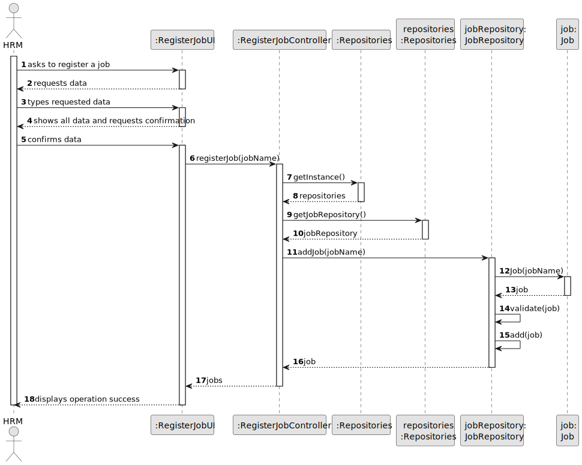
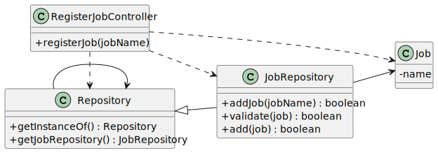

# US002 - Register a Job

## 3. Design - User Story Realization

### 3.1. Rationale

_**Note that SSD - Alternative One is adopted.**_

| Interaction ID | Question: Which class is responsible for... | Answer               | Justification (with patterns)                                                  |
|:---------------|:--------------------- |:---------------------|:-------------------------------------------------------------------------------|
| Step 1  		     |	... interacting with the actor? | RegisterJobUI        | Pure Fabrication: UI interaction doesn't align with any specific domain class. |
| 		             |	... coordinating the US? | RegisterJobController| Controller                                                                     |
| 		             |	... instantiating a new Job? | JobRepository       | Creator (Rule 1): Repository responsible for managing Job instances.           |
| Step 2  		     |	... requesting data? | RegisterJobUI        | Pure Fabrication: UI interacts directly with user.                             |
| Step 3  		     |	... displaying data and confirming? | RegisterJobUI        | Pure Fabrication: UI interaction doesn't align with any specific domain class. |
| Step 4  		     |	... confirming data? | RegisterJobUI        | Pure Fabrication: UI interaction doesn't align with any specific domain class. |
| Step 5  		     |	... registering job? | RegisterJobController| Controller                                                                     |
| 		             |	... getting repository instance? | Repository           | Singleton (GoF): Repository provides singleton instance.                       |
| 		             |	... getting job repository? | Repository           | Singleton (GoF): Repository provides JobRepository instance.                   |
| 		             |	... adding job to repository? | JobRepository       |                                                                                |
| 		             |	... validating job? | JobRepository       |                                                                                |
| Step 6  		     |	... informing success? | RegisterJobUI        | Pure Fabrication: UI interaction doesn't align with any specific domain class. |

### Systematization ##

According to the taken rationale, the conceptual classes promoted to software classes are:

* RegisterJobController
* JobRepository
* Job

Other software classes (i.e. Pure Fabrication) identified:

* RegisterJobUI
* Repository

## 3.2. Sequence Diagram (SD)

### Full Diagram

This diagram shows the full sequence of interactions between the classes involved in the realization of this user story.

### Split Diagrams

The following diagram shows the same sequence of interactions between the classes involved in the realization of this user story, but it is split in partial diagrams to better illustrate the interactions between the classes.

## 3.3. Class Diagram (CD)

