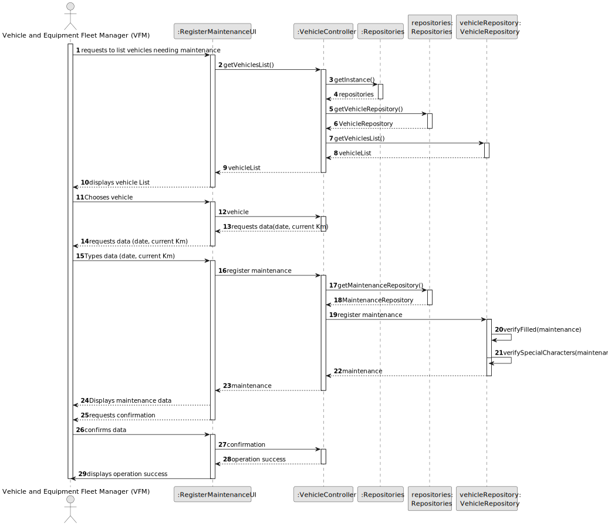
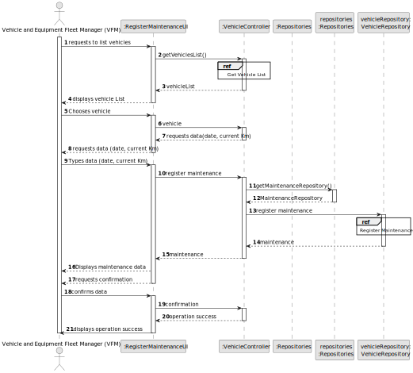
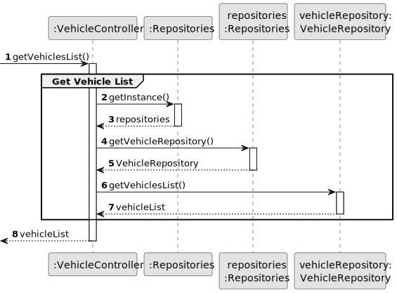
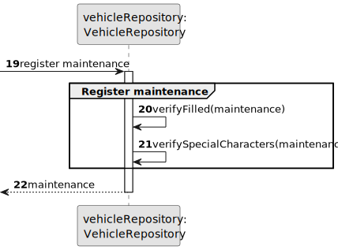
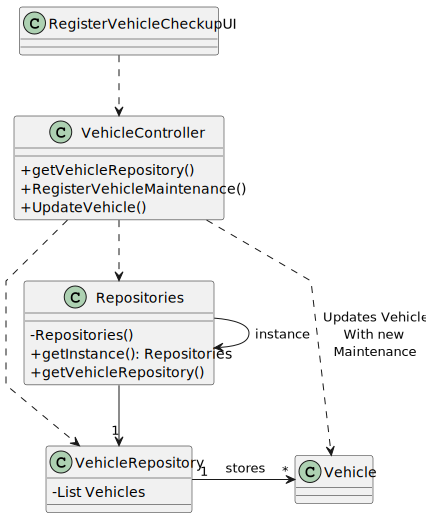

# US007 - Register a vehicle's check-up

## 3. Design - User Story Realization

### 3.1. Rationale

_**Note that SSD - Alternative One is adopted.**_

| Interaction ID | Question: Which class is responsible for...       | Answer            | Justification (with patterns)                                                                                                   |
|:---------------|:--------------------------------------------------|:------------------|:--------------------------------------------------------------------------------------------------------------------------------|
| Step 1         | 	... interacting with the actor?                  | ListMaintenanceUI | Pure Fabrication: ListMaintenanceUI there is no reason to assign this responsibility to any existing class in the Domain Model. |
| 			  		        | 	... coordinating the US?                         | VehicleController | Controller                                                                                                                      |
| Step 2         | 	displaying the form for the actor to input data? | ListMaintenanceUI | Pure Fabrication: ListMaintenanceUI there is no reason to assign this responsibility to any existing class in the Domain Model. |
| Step 3	        | 	...instaliating a new vehicle's checkup?         | VehicleRepository | Repository                                                                                                                      |
| 		             | 	...saving the inputted data?                     | VehicleRepository | Repository                                                                                                                      |
| 		             | 	... validating all data (local validation)       | Vehicle           | IE: The vehicle class should do all verifications related to vehicles                                                           |
| 			  		        | 	... validating all data (global validation)?     | VehicleRepository | Repository                                                                                                                      | 
| 			  		        | 	... saving the registered vehicle checkup?       | VehicleRepository | Repository                                                                                                                      | 
| Step 4  		     | 	... informing operation success?                 | ListMaintenanceUI | Pure Fabrication: ListMaintenanceUI there is no reason to assign this responsibility to any existing class in the Domain Model. |

### Systematization ##

According to the taken rationale, the conceptual classes promoted to software classes are:

* Vehicle
* VehicleController
* VehicleRepository

  Other software classes (i.e. Pure Fabrication) identified:

* ListMaintenanceUI

## 3.2. Sequence Diagram (SD)

_**Note that SSD - Alternative Two is adopted.**_

### Full Diagram

This diagram shows the full sequence of interactions between the classes involved in the realization of this user story.

### Split Diagrams

The following diagram shows the same sequence of interactions between the classes involved in the realization of this
user story, but it is split in partial diagrams to better illustrate the interactions between the classes.

It uses Interaction Occurrence (a.k.a. Interaction Use).

**Get Vehicles List**

**Create Maintenance**

## 3.3. Class Diagram (CD)

