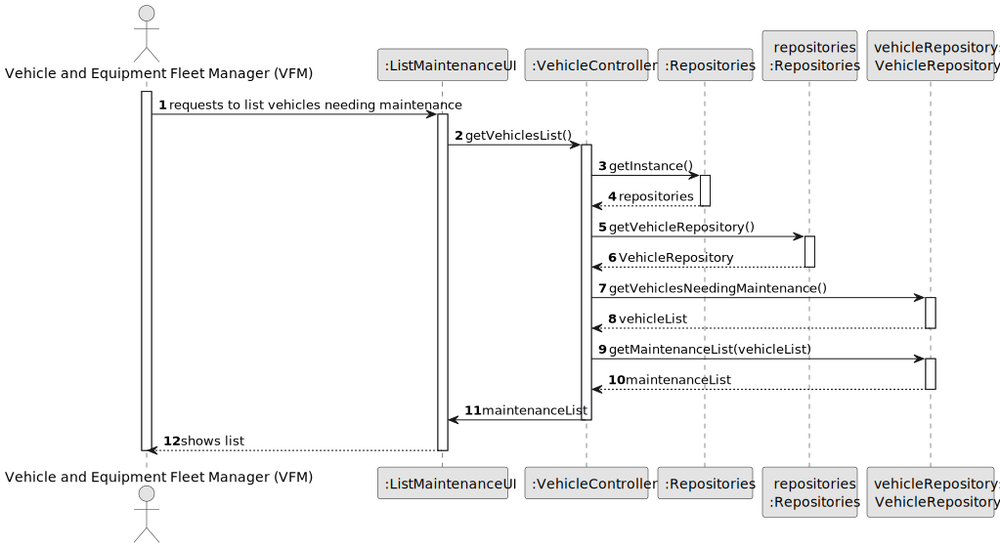
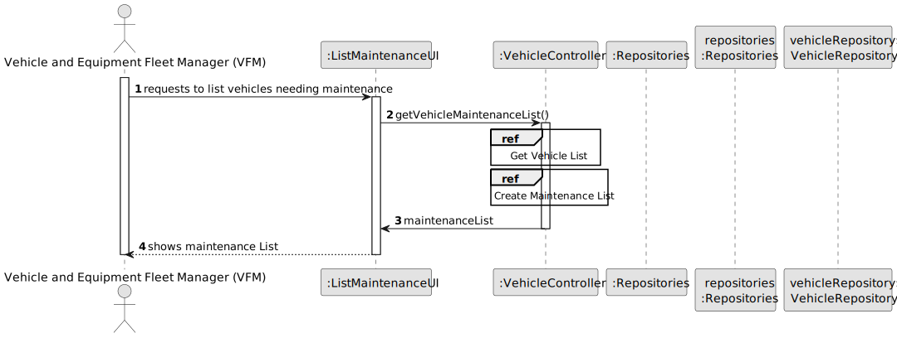
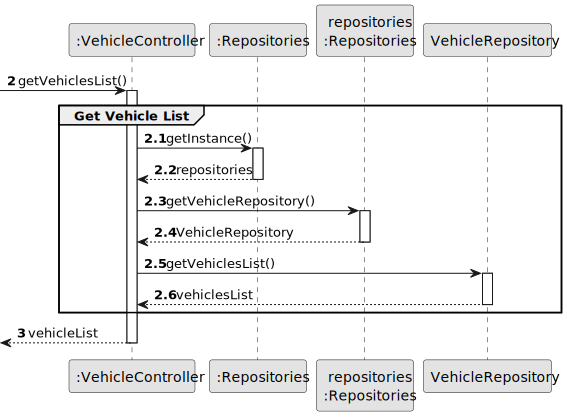
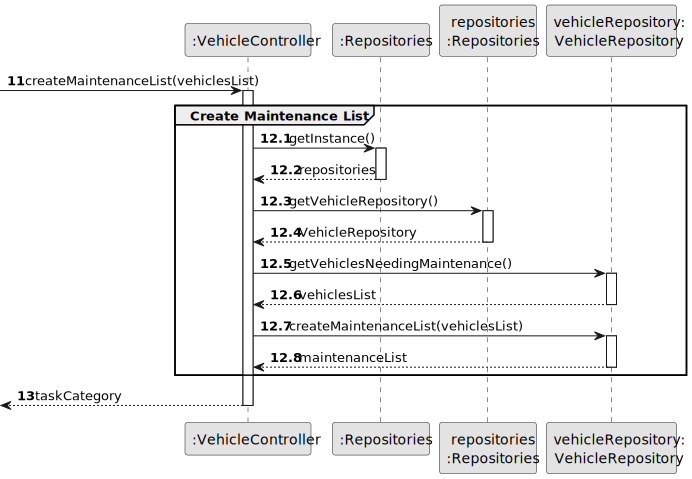

# US008 - List of the vehicles needing the check-up

## 3. Design - User Story Realization

### 3.1. Rationale

_**Note that SSD - Alternative One is adopted.**_

| Interaction ID | Question: Which class is responsible for...   | Answer            | Justification (with patterns)                                                                                                 |
|:---------------|:----------------------------------------------|:------------------|:------------------------------------------------------------------------------------------------------------------------------|
| Step 1         | ... interacting with the actor?               | ListMaintenanceUI | Pure Fabrication: There is no need to assign this responsibility to any existing class in the Domain Model.                   |
|                | ... coordinating the US?                      | VehicleController | Controller                                                                                                                    |
|                | ... handles the creation of the report?       | VehicleController | Controller                                                                                                                    |
|                | ... get VehicleRepository?                    | Repositories      | Repository                                                                                                                    |
|                | ... knowing the vehicles needing maintenance? | VehicleRepository | Repository                                                                                                                    |
|                | ... Knowing last check-up of a vehicle?       | VehicleRepository | Repository                                                                                                                    |
|                | ... creating a maintenance list?              | VehicleRepository | Repository                                                                                                                    |
|                | ... validating all data (local validation)?   | Vehicle           | IE: Vehicle owns its data and is responsible for local validation of its attributes, ensuring data integrity and consistency. | 
|                | ... validating all data (global validation)?  | VehicleRepository | Repository                                                                                                                    | 
| Step 2         | ... informing created maintenance report?     | ListMaintenanceUI | Pure Fabrication: There is no need to assign this responsibility to any existing class in the Domain Model.                   |

### Systematization ##

According to the taken rationale, the conceptual classes promoted to software classes are:

* Vehicle
* VehicleRepository
* Repositories

  Other software classes (i.e. Pure Fabrication) identified:

* ListMaintenanceUI

## 3.2. Sequence Diagram (SD)

_**Note that SSD - Alternative Two is adopted.**_

### Full Diagram

This diagram shows the full sequence of interactions between the classes involved in the realization of this user story.

### Split Diagrams

The following diagram shows the same sequence of interactions between the classes involved in the realization of this
user story, but it is split in partial diagrams to better illustrate the interactions between the classes.

It uses Interaction Occurrence (a.k.a. Interaction Use).

**Get Vehicles List**

**Create Maintenance List**

## 3.3. Class Diagram (CD)

