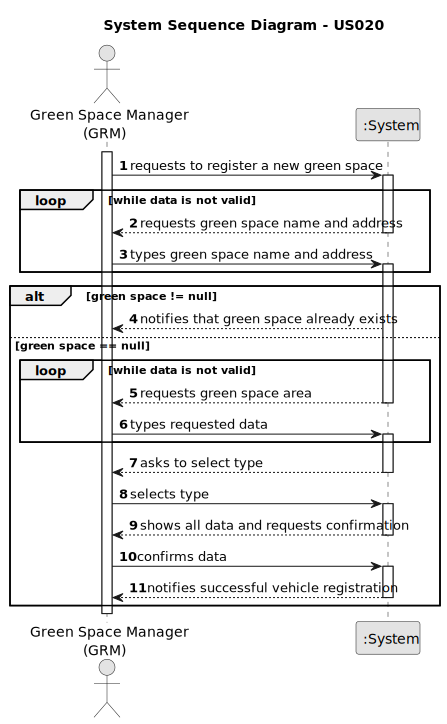

# US020 - Register a green space

## 1. Requirements Engineering

### 1.1. User Story Description

As a GSM, I want to register a green space, which has a name, an area, a type and an address.

### 1.2. Customer Specifications and Clarifications

**From the specifications document:**

> Parks can be of three types: garden, medium-sized park, or large-sized park

**From the client clarifications:**

> **Question:** In which unit should the area be measured in?
> 
> **Answer:**  Usually, areas are measured in hectares.

> **Question:** We understand that type (garden, medium-size, large-size), area, name, and address are required inputs for a Green Space (and if we are wrong in this, please correct us), but are there any other inputs that we are unaware of?
>
> **Answer:** Seems enough.

> **Question:** To register a green space, what is the criteria needed to classify it as a medium-sized park or a large-sized park?
> 
> **Answer:** It's a GSM responsibility to decide the classification.

> **Question:** Can two green spaces have the same name?
>
> **Answer:** No.

> **Question:** IShould the Green Space have any field in which it would store the GSM who created it, meaning that green space is managed by that GSM?
>
> **Answer:** I have no knowledge about data models.

> **Question:** Good afternoon, I would like to know between what ranges of hectares a green space is classified as garden, medium or large, or if it is possible to register 2 green spaces with the same area but in different typology, depending on the GSM it registers.
>
> **Answer:** The classification is not automatic, it's up to GSM decide about it.

> **Question:** Can two different green spaces have the same address?
>
> **Answer:** No

### 1.3. Acceptance Criteria

* **AC1:** All required fields must be filled in.
* **AC2** The green space must not already exist in the system.
* **AC3:** The area must be greater than zero.

### 1.4. Found out Dependencies

* None 

### 1.5 Input and Output Data

**Input Data:**
  
* Typed data:
    * The area
    * The name
    * The city
    * The zip code
    * The street address

* Selected data:
    * The type of the green space

**Output Data:**

* (In)Success of the operation
* The information of the green space

### 1.6. System Sequence Diagram (SSD)

### 1.7 Other Relevant Remarks

* The GSM is responsible for classifying the green space as a garden, medium-sized park, or large-sized park.
* The area is measured in hectares.
* The green space must not already exist in the system.
* Two green spaces cannot have the same name.
* The GSM can also delete a registered green space or update it.
* One green space cant have the same address as another green space.
* 