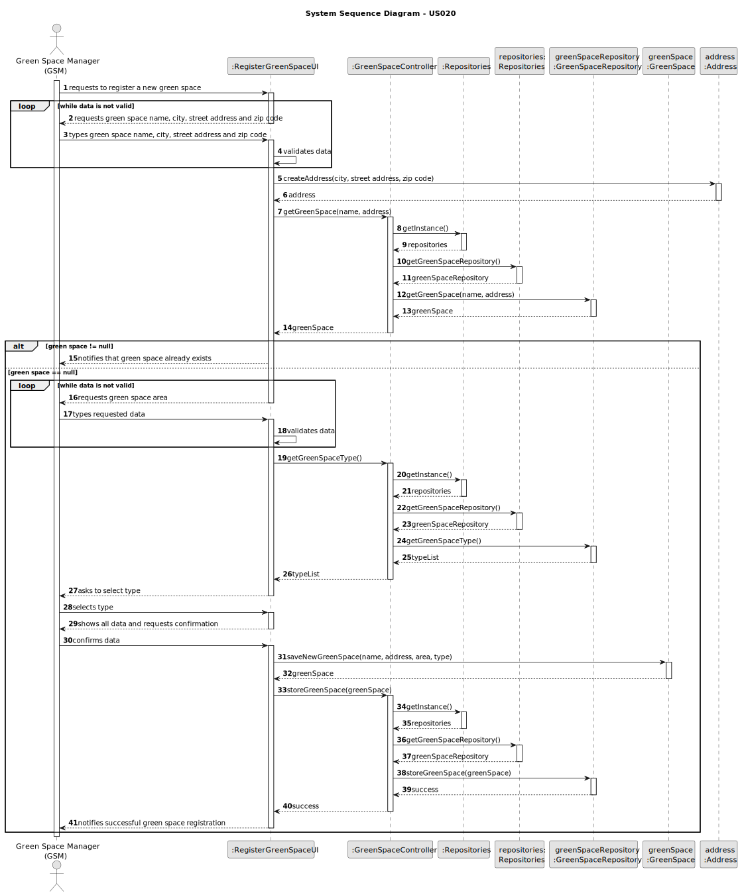
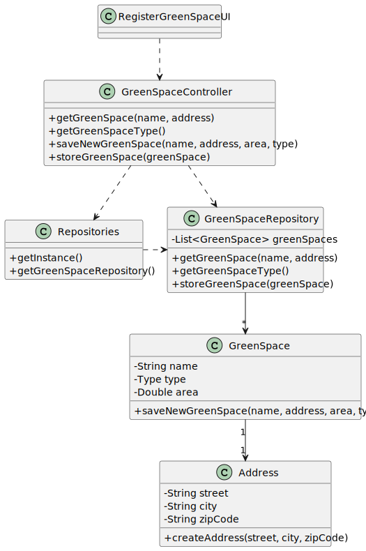

# US020 - Register a Green Space

## 3. Design - User Story Realization

### 3.1. Rationale

| Interaction ID                                                           | Question: Which class is responsible for...                            | Answer               | Justification (with patterns)                                                                                |
|:-------------------------------------------------------------------------|:-----------------------------------------------------------------------|:---------------------|:-------------------------------------------------------------------------------------------------------------|
| Step 1: Requests to register a new green space 		                        | 	... interacting with the user?                                        | RegisterGreenSpaceUI | Pure Fabrication: there is no reason to assign this responsibility to any existing class in the Domain Model |
| 			  		                                                                  | 	... coordinating the US?                                              | GreenSpaceController | Controller                                                                                                   |
| Step 2: Requests green space name, city, street address and zip code  		 | 	... requesting green space name and address?						                    | RegisterGreenSpaceUI | IE: Responsible for interacting with the user                                                                |
| Step 3: Types green space name, city, street address and zip code        | 	... validating data?                                                  | RegisterGreenSpaceUI | IE: Responsible for validating data                                                                          |
|                                                                          | ... temporarily keeping the typed data?                                | RegisterGreenSpaceUI | IE: Responsible for keeping the selected and typed data temporarily                                          |
|                                                                          | ... accessing the repository to see if the green space already exists? | GreenSpaceController | IE: Its the controller with access to the green space repository                                             |
| Step 4: Requests green space area		                                      | 	...interacting with the user?                                         | RegisterGreenSpaceUI | IE: Responsible for interacting with the user                                                                |
| Step 5: Types requested data                                             | ... accessing the green space repository to get the list of types?     | GreenSpaceController | IE: Its the controller that has access to the green space repository                                         |
| 			  		                                                                  | 	... validating data?                                                  | RegisterGreenSpaceUI | IE: Responsible for validating data                                                                          |
| Step 6: Asks to select type                                              | 	... interacting with the user?                                        | RegisterGreenSpaceUI | IE: Responsible for interacting with the user                                                                |
| Step 7: Selects a type                                                   | ... temporarily keeping the typed data?                                | RegisterGreenSpaceUI | IE: Responsible for keeping the selected and typed data temporarily                                          |                    |
| Step 8: Shows all data and requests confirmation                         | ... showing all data and requesting confirmation?                      | RegisterGreenSpaceUI | IE: Temporarily knows inputted data until user confirmation                                                  |
| Step 9: Confirms data		                                                  | ... saving all the data?                                               | GreenSpaceRepository | IE: Responsible for storing green space type objects                                                         |              
| Step 10: Informs that green space was registered                         | ... informing operation success?                                       | RegisterGreenSpaceUI | IE: Responsible for interacting with the user                                                                |

### Systematization ##

According to the taken rationale, the conceptual classes promoted to software classes are:

* GreenSpaceController
* GreenSpaceRepository 
* GreenSpace
* Address

Other software classes (i.e. Pure Fabrication) identified:

* RegisterGreenSpaceUI

## 3.2. Sequence Diagram (SD)

### Full Diagram

This diagram shows the full sequence of interactions between the classes involved in the realization of this user story.

### Split Diagrams

N/A

## 3.3. Class Diagram (CD)

