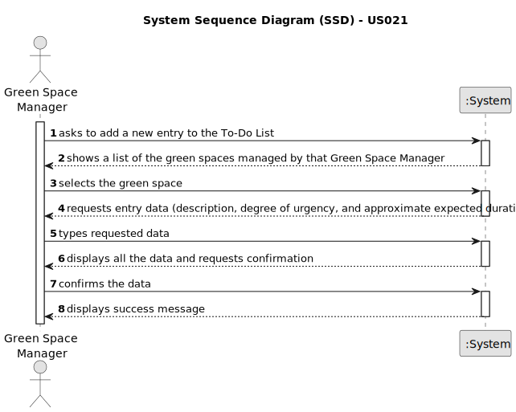

# US021 - Add a new toDoEntry to the To-Do List

## 1. Requirements Engineering

### 1.1. User Story Description

As a Green Space Maneger (GSM), I want to add a new toDoEntry to the To-Do List.

### 1.2. Customer Specifications and Clarifications

**From the specifications document:**

>   These tasks can be regular (e.g. pruning trees) or occasional (e.g. repairing a broken equipment).  
>   They may also require a multi-disciplinary team and the length of the task can vary from a few minutes (e.g. replacing a light bulb) to weeks (e.g. installing an irrigation system).

**From the client clarifications:**

> **Question:** When creating a new entry for the to-do list:

> - If there are multiple GSM in the system, can a GSM create an entry for a Green Space managed by another GSM? 

> - For a regular task, should the GSM define the frequency in which the tasks needs to be performed?

> - Should the to-do entries be unique or can a GSM repeat the same to-do entry, for the same Green Space, multiple times 

> - If the To-Do entry is assigned to the Agenda, should it be removed for the To-Do entry, if it only occasional? 

> - What are the details the GSM needs to input, other than the Green Space, frequency, estimated duration?Title and description are required? 

> - Should the GSM define the skills needed for a To-Do entry?

> **Answer:** When creating a new entry for the to-do list:

> - If there are multiple GSM in the system, can a GSM create an entry for a Green Space managed by another GSM?
  No;

> - For a regular task, should the GSM define the frequency in which the tasks needs to be performed?
  Not for this sprint;

> - Should the to-do entries be unique or can a GSM repeat the same to-do entry, for the same Green Space, multiple times
  Yes; Assuming the previous task with same description was previously processed and is not open anymore.

> - If the To-Do entry is assigned to the Agenda, should it be removed for the To-Do entry, if it only occasional?
  Should change the status to processed.

> - What are the details the GSM needs to input, other than the Green Space, frequency, estimated duration?Title and description are required?
  no but maybe it should be done for type of task (or similar)

> **Question:** Are the new entries on the list divided in categories?

> **Answer:** In the scope of the current proof-of-concept, there are no user stories using that categories.

> **Question:** Our team is unsure about what the exact inputs for the Green Space, To-Do List Entry, and Agenda entry exactly are.

> We understand that type (garden, medium-size, large-size), area, name, and address are required inputs for a Green Space (and if we are wrong in this, please correct us), but are there any other inputs that we are unaware of?

> And when it comes to To-Do List entries, we identified a state (planned, postponed, completed, canceled), a green space, a title, and a description as inputs for a To-Do List entry. But are there any more? We also know that an Agenda entry has a target date, but is this target date supposed to be inputted upon transferring a task from the to-do list to the agenda, or is it supposed to be inputted upon creating the task in the to-do list?

> Finally, during the last client meeting, we became aware that some tasks are meant to be reoccurring rather than occasional. Is this something that should be asked on creating the task in the to-do list? If so, what inputs should we expect from the user? The task's frequency in days?

> **Answer:** Our team is unsure about what the exact inputs for the Green Space, To-Do List Entry, and Agenda entry exactly are.

> We understand that type (garden, medium-size, large-size), area, name, and address are required inputs for a Green Space (and if we are wrong in this, please correct us), but are there any other inputs that we are unaware of?

> Seems enough.

> And when it comes to To-Do List entries, we identified a state (planned, postponed, completed, canceled), a green space, a title, and a description as inputs for a To-Do List entry. But are there any more?

> In the text you can find: the degree of urgency (High, Medium,and Low), and the approximate expected duration.

> We also know that an Agenda entry has a target date, but is this target date supposed to be inputted upon transferring a task from the to-do list to the agenda, or is it supposed to be inputted upon creating the task in the to-do list?

> To-do list entries doesn't have dates!

> Finally, during the last client meeting, we became aware that some tasks are meant to be reoccurring rather than occasional. Is this something that should be asked on creating the task in the to-do list? If so, what inputs should we expect from the user? The task's frequency in days?

> For the current proof-of-concept there is no need to distinguish between recurring and occasional tasks.

> **Question:** When a new entry is added to the ToDo list, the default status of that task will be "pending" or no status at all is considered on ToDo list?
Similarly, when a new entry is added to the Agenda, the status of that task will be, by default, set to "planned", right?

> **Answer:** "Pending" as default for to-do list entries and "Planned" as default for Agenda entries, sounds good;

> **Question:** What time unit should be used for the duration of the task?

> **Answer:** Hour and/or days.

> **Question:** When a to-do list entry is added to the agenda, what should its state be?
>
> **Answer:** Maybe "planned".

> **Question:** Is it mandatory for the program to have multiple GSM? If so, should each green space be associated with a responsible GSM? In other words, can only the GSM assigned to a specific green space register a new entry for the to-do list?
>
> **Answer:** The program can have multiple GSM.  Yes. Yes.

### 1.3. Acceptance Criteria

* **AC1:** The new toDoEntry must be associated with a green space managed by the GSM.
* **AC2:** The green space for the new toDoEntry should be chosen from a list presented to the GSM.

### 1.4. Found out Dependencies

* There is a dependency on "US020 - Register a Green Space and its area" - there has to be a green space registered in the system to be associated with the new toDoEntry.

### 1.5 Input and Output Data

**Input Data:**

* Typed data:
  * Designation
  * Expected duration

* Selected data:
  * Degree of urgency
  * Green Space 

**Output Data:**

  *(In)Success of the operation

### 1.6. System Sequence Diagram (SSD)

**_Other alternatives might exist._**

#### Alternative One

### 1.7 Other Relevant Remarks

* None