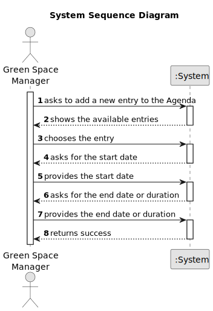

# US023 - Add an entry to the Agenda

## 1. Requirements Engineering

### 1.1. User Story Description

As a GSM, I want to assign a Team to an entry in the Agenda.

### 1.2. Customer Specifications and Clarifications

**From the specifications document:**

> The Agenda is made up of todo-list entries, the team that will carry out the task,
> the vehicles/equipment assigned
> to the task, expected duration, and the status.

**From the client clarifications:**

> **Question:** Tasks have a status of Planned, Postponed, Canceled or Done. When do they pass to "Planned" status? When
> they are added to the agenda (before the GSM assigns a team) or when a team is assigned to them?
>
>**Answer:** The use of states and their values is a technical modeling issue, it is not the client's responsibility.
> Assuming you are using states, a task would become "Planned" as soon as it enters the Agenda.

> **Question:** Task duration should be considered in hours or in half days (morning/afternoon)?
>
>**Answer:** Hours should be ok, but keep in mind, that the storage format doesn't need to be same as the input/output
> format.

> **Question:** When a To-Do List entry is planned and moves to the Agenda, the status change from "Pending" to "
> Planned". Should this entry be removed from the To-Do List or just change status to "Planned" as it is on the Agenda?
>
>**Answer:** Changing the status in the To-Do list to Planned seems to be a good approach.

> **Question:**When the GSM plans a task (that was previously in To-Do) into the Agenda, what aditional data/information
> does he need to input when planning?
>
>**Answer:** The starting date for the task.
> Later the GSM will be able to add the Team and vehicles (if required).

> **Question:** When a new entry is added to the ToDo list, the default status of that task will be "pending" or no status at all is
> considered on ToDo list?
> Similarly, when a new entry is added to the Agenda, the status of that task will be, by default, set to "planned",
> right?
>
> **Answer:**"Pending" as default for to-do list entries and "Planned" as default for Agenda entries, sounds good;

> **Question:** We also know that an Agenda entry has a target date, but is this target date supposed to be inputted upon transferring a task from the to-do list to the agenda, or is it supposed to be inputted upon creating the task in the to-do list?
> 
> **Answer:** To-do list entries doesn't have dates!

> **Question:** Finally, during the last client meeting, we became aware that some tasks are meant to be reoccurring rather than occasional. Is this something that should be asked on creating the task in the to-do list? If so, what inputs should we expect from the user? The task's frequency in days?
> 
> **Answer:** For the current proof-of-concept there is no need to distinguish between recurring and occasional tasks.

### 1.3. Acceptance Criteria

* **AC1:** The Start Date and a duration or the end date  are required to add an entry to the Agenda.
* **AC2:** The system must use the provided end date and duration if both are provided
* **AC3:** The system must calculate the one not provided if the user only provided either the duration or the end date

### 1.4. Found out Dependencies

* There is a dependency on "US021 - As a GSM, I want to add a new entry to the To-Do List.

### 1.5 Input and Output Data

**Input Data:**

* Typed data:
    * Duration

* Chosen Data:
    * Start Date
    * End Date

**Output Data:**

* A new entry in the Agenda

### 1.6. System Sequence Diagram (SSD)

### 1.7 Other Relevant Remarks

* n/a