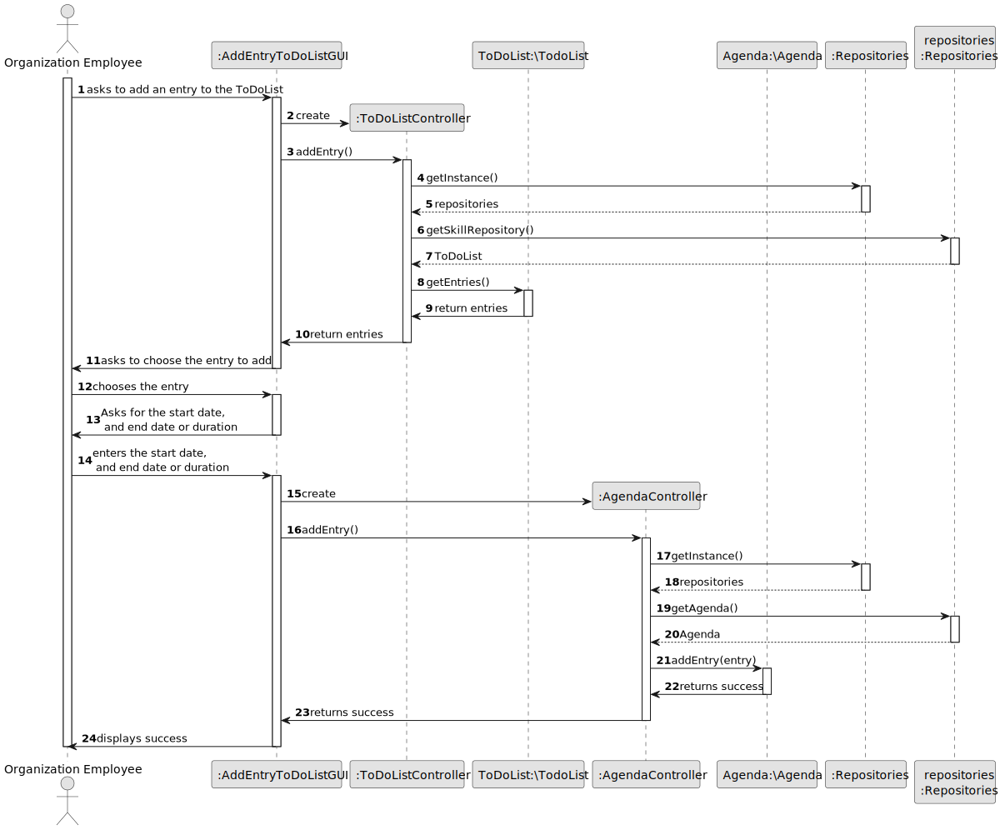

# US004 - Add a skill to a collaborator

## 3. Design - User Story Realization

### 3.1. Rationale

| Interaction ID                                                            | Question: Which class is responsible for...            | Answer              | Justification (with patterns)                                                                                 |
|:--------------------------------------------------------------------------|:-------------------------------------------------------|:--------------------|:--------------------------------------------------------------------------------------------------------------|
| Step 1: asks to add an entry to the agenda  		                            | 	... interacting with the actor?                       | AddEntryToAgendaGUI | Pure Fabrication: there is no reason to assign this responsibility to any existing class in the Domain Model. |
| 			  		                                                                   | 	... coordinating the US?                              | AddEntryToAgendaGUI | Pure Fabrication: there is no reason to assign this responsibility to any existing class in the Domain Model. |
| Step 2: Shows the list of entries  		                                     | 		... interacting with the actor?					                 | AddEntryToAgendaGUI | Pure Fabrication: there is no reason to assign this responsibility to any existing class in the Domain Model. |
| Step 3: Choosing the Entry                                                | 	... interacting with the actor?                       | AddEntryToAgendaGUI | Pure Fabrication: there is no reason to assign this responsibility to any existing class in the Domain Model. |
|                                                                           | ... accessing the repository to get the entry list     | ToDoListController  | IE: Controller                                                                                                |
|                                                                           | ... getting the entry list                             | ToDoList            | IE: repository                                                                                                |
| Step 4: asks for the start date and end dates or duration of the task  		 | 	...interacting with the actor?                        | AddEntryToAgendaGUI | Pure Fabrication: there is no reason to assign this responsibility to any existing class in the Domain Model. |
| Step 5: Chooses the dates                                                 | 	... interacting with the actor?                       | AddEntryToAgendaGUI | Pure Fabrication: there is no reason to assign this responsibility to any existing class in the Domain Model. |
|                                                                           | ... accessing the repository to add a new agenda entry | AgendaController    | IE: Controller                                                                                                |
|                                                                           | ... storing the new entry                              | Agenda              | IE: repository                                                                                                |
| Step 6: Displays operation success 		                                     | ... interacting with the actor?							                 | AddEntryToAgendaGUI | Pure Fabrication: there is no reason to assign this responsibility to any existing class in the Domain Model  |              

### Systematization ##

According to the taken rationale, the conceptual classes promoted to software classes are:

* ToDoListController
* ToDoList
* AgendaController
* Agenda

Other software classes (i.e. Pure Fabrication) identified:

* AddEntryToAgendaGUI

## 3.2. Sequence Diagram (SD)

### Full Diagram

This diagram shows the full sequence of interactions between the classes involved in the realization of this user story.

### Split Diagrams

N/A

## 3.3. Class Diagram (CD)

