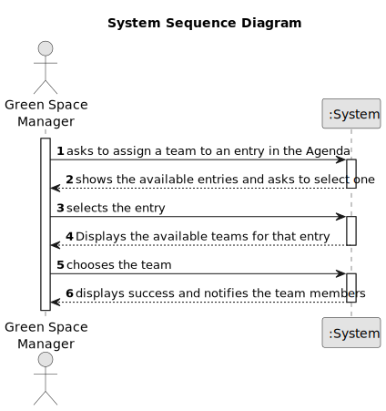

# US023 - Assign a team to an agenda entry

## 1. Requirements Engineering

### 1.1. User Story Description

As a HRM, I want to add a skill to a collaborator.

### 1.2. Customer Specifications and Clarifications

**From the specifications document:**

> Teams are the groups of collaborators that work together in a project. The teams are created by the HRM and are
> associated with an agenda entry. The teams are composed of collaborators that have the skills required by the HRM.

**From the client clarifications:**

> **Question:** 1) When I choose to associate a team with an agenda entry, is there a maximum number of team members? 2)
> Are the team members collaborators, GSM...? We can choose them through their email, right?
>
>**Answer:** Have you ever read the text of the US05 concerning the generation of Teams?

> **Question:** Should the team be generated like in the us05 or should each element be selected manually?
>
> **Answer:** There is only one US that allows to create teams, as you mentioned, the US05.

### 1.3. Acceptance Criteria

* **AC1:** All required fields must be filled in.
* **AC2:** The team must be free in the time of the entry

### 1.4. Found out Dependencies

* There is a dependency on "US005 - As an HRM, I want to generate a team proposal automatically" - the team has to be
  generated
* There is a dependency on "US0022 - As a GSM, I want to add a new entry in the Agenda." - the agenda entry must exist
  in order to add a team to it

### 1.5 Input and Output Data

**Input Data:**

* Chosen data:
    * Team
    * Entry 

**Output Data:**

* (In)Success of the operation

### 1.6. System Sequence Diagram (SSD)

### 1.7 Other Relevant Remarks

* The user can always choose a different person to add the skill in case he makes a mistake