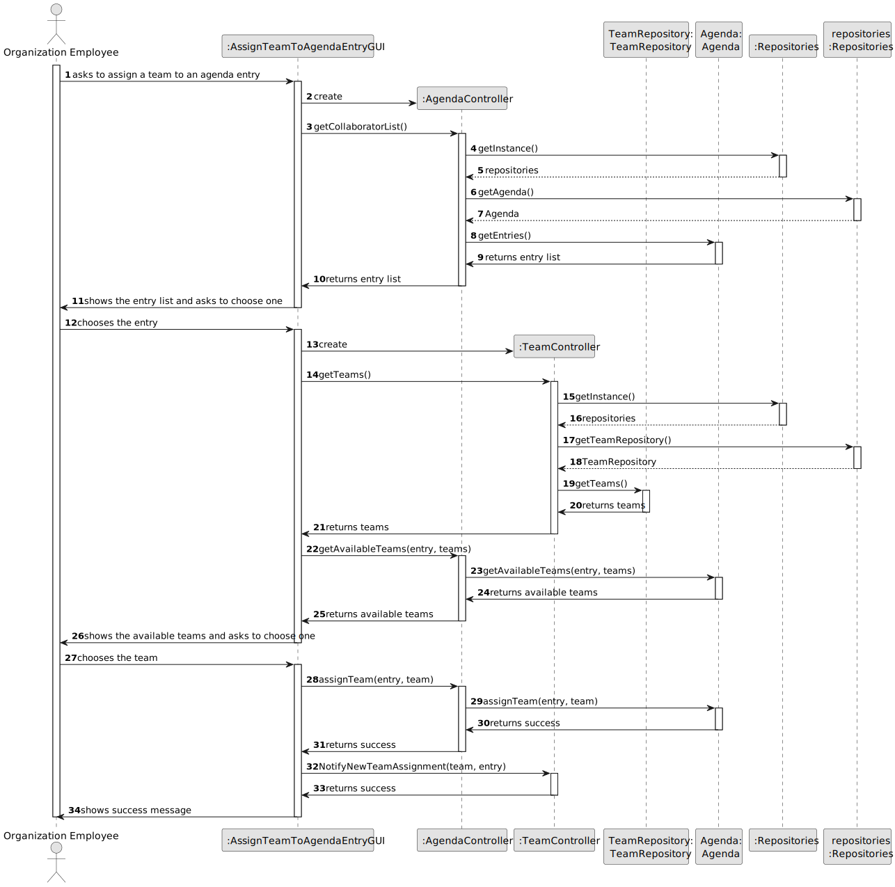

# US023 - Assign a team to the agenda entry

## 3. Design - User Story Realization

### 3.1. Rationale

| Interaction ID                                   | Question: Which class is responsible for...                | Answer                     | Justification (with patterns)                                                                                 |
|:-------------------------------------------------|:-----------------------------------------------------------|:---------------------------|:--------------------------------------------------------------------------------------------------------------|
| Step 1: asks to assign a team to an agenda entry | ... interacting with the actor?                            | AssignTeamToAgendaEntryGUI | Pure Fabrication: there is no reason to assign this responsibility to any existing class in the Domain Model. |
|                                                  | ... coordinating the US?                                   | AssignTeamToAgendaEntryGUI | Pure Fabrication: there is no reason to assign this responsibility to any existing class in the Domain Model. |
| Step 2: Shows the list of entries                | ... interacting with the actor?                            | AssignTeamToAgendaEntryGUI | Pure Fabrication: there is no reason to assign this responsibility to any existing class in the Domain Model. |
|                                                  | ... accessing the repository to get the entry list         | AgendaController           | IE: its the controller with access to the agenda repository                                                   |
|                                                  | ... getting the entry list                                 | Agenda                     | IE: its the class that stores the entry's information                                                         |
| Step 3: Choosing the entry                       | ... interacting with the actor?                            | AssignTeamToAgendaEntryGUI | Pure Fabrication: there is no reason to assign this responsibility to any existing class in the Domain Model. |
| Step 4: shows the list of teams                  | ... interacting with the actor?                            | AssignTeamToAgendaEntryGUI | Pure Fabrication: there is no reason to assign this responsibility to any existing class in the Domain Model. |
|                                                  | ... accessing the team repository to get the list of teams | TeamController             | IE: its the controller that has access to the team repository                                                 |
|                                                  | ... getting the team list                                  | TeamRepository             | IE: its the repository that stores the team's information                                                     |
| Step 5: Chooses the team                         | ... interacting with the actor?                            | AssignTeamToAgendaEntryGUI | Pure Fabrication: there is no reason to assign this responsibility to any existing class in the Domain Model. |
|                                                  | ... assigning the team to the entry                        | AgendaController           | IE: its the controller that manages the agenda entries                                                        |
|                                                  | ... saving the team assignment                             | Agenda                     | IE: Manages entry's information                                                                               |
| Step 6: Displays operation success               | ... interacting with the actor?                            | AssignTeamToAgendaEntryGUI | Pure Fabrication: there is no reason to assign this responsibility to any existing class in the Domain Model  |

### Systematization ##

According to the taken rationale, the conceptual classes promoted to software classes are:

* AgendaController
* Agenda
* TeamController
* TeamRepository

Other software classes (i.e. Pure Fabrication) identified:

* AssignTeamToAgendaEntryGUI

## 3.2. Sequence Diagram (SD)

### Full Diagram

This diagram shows the full sequence of interactions between the classes involved in the realization of this user story.

### Split Diagrams

N/A

## 3.3. Class Diagram (CD)

