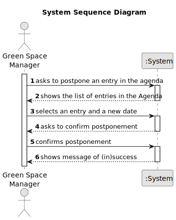

# US024 - Postpone an entry in the Agenda

## 1. Requirements Engineering

### 1.1. User Story Description

As a GSM, I want to Postpone an entry in the Agenda to a specific future date.

### 1.2. Customer Specifications and Clarifications

**From the specifications document:**

> Skills are what enables a collaborator to do a certain task

**From the client clarifications:**

> **Question:** The selected task(s) will be postponed by one interval defined by the user or for the next day?
>
> **Answer:** When postponing a task, the new predicated date for execution should be inserted.

> **Question:** The date you want to postpone in this US24 is the date referring to the "approximate expected duration" field when we registered the task?

> **Answer:** No; sometimes, for various reasons (e.g. insufficient staff, faulty equipment or adverse weather conditions) a task has to be postponed to a new date; task duration is not directly related to this.
>
> **Question:** When entry is postponed should it be deleted from the Agenda and moved to the To-Do list?
> 
> **Answer:** No.

> **Question:** What are the input to postpone an entry?
> 
> **Answer** The Green Spaces Manager only needs to select the entry and introduce the new date.

### 1.3. Acceptance Criteria

* **AC1:** The GSM can select an entry in the Agenda and postpone it to a specific future date.
* **AC2:** The postponed entry is not deleted from the Agenda.

### 1.4. Found out Dependencies

* There is a dependency on the US023 - Add an entry to the Agenda, since the entry to be postponed must be in the Agenda.

### 1.5 Input and Output Data

**Input Data:**

* Typed data:
  * Entry to be postponed

**Output Data:**

* (In)Success of the operation

### 1.6. System Sequence Diagram (SSD)

### 1.7 Other Relevant Remarks

* 