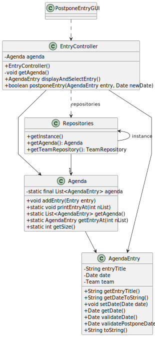

# US024 - Postpone an entry in the Agenda 

## 3. Design - User Story Realization

### 3.1. Rationale

| Interaction ID | Question: Which class is responsible for...  | Answer            | Justification (with patterns)                                                                                      |
|:---------------|:---------------------------------------------|:------------------|:-------------------------------------------------------------------------------------------------------------------|
| Step 1         | ... interacting with the actor?              | PostponeEntryUI   | Pure Fabrication: The is no reason to assign this responsability to any existing class in the Domain Model         |
|                | ... coordinating the US?                     | EntryController   | Controller                                                                                                         |
|                | ... getting EntryRepository?                 | Repositories      | Repository                                                                                                         |
|                | ... getting agendaEntry list?                | EntryRepository   | Repository                                                                                                         |
| Step 2         | ... show the agendaEntry list?               | PostponeEntryUI   | Pure Fabrication: The UI class is responsible for displaying information to the user                               |
| Step 3         | ... selecting a agendaEntry ?                | PostponeEntryUI   | Pure Fabrication: The UI class is responsible for capturing user input                                             |
| Step 4         | ... requesting new date for the agendaEntry? | PostponeEntryUI   | Pure Fabrication: The UI class is responsible for capturing user input                                             |
| Step 5         | ... submitting the new date?                 | EntryController   | Controller:                                                                                                        |
| Step 6         | ... displaying agendaEntry  data?            | PostponeEntryUI   | Pure Fabrication: The UI class is responsible for displaying information to the user                               |
| Step 7         | ... confirms data                            | PostponeEntryUI   | Pure Fabrication: The UI class is responsible for capturing user input                                             |
|                | ... validate submitted data?                 | EntryRepository   | Repository                                                                                                         |
|                | ... postponing the agendaEntry?              | EntryRepository   | Repository                                                                                                         | 
|                | ... create new agendaEntry?                  | EntryRepository   | Repository                                                                                                         |
|                | ... verify local data?                       | AgendaEntry       | Information Expert: The AgendaEntry class has the information about the entry and is responsible for verifying it. |
|                | ... notifying the team?                      | TeamRepository    | Repository                                                                                                         | 
| Step 8         | ... informing operation success?             | PostponeEntryUI   | Pure Fabrication: The UI class is responsible for displaying information to the user                                                                                                 | 

### Systematization ##

According to the taken rationale, the conceptual classes promoted to software classes are:

* AgendaEntry

Other software classes (i.e. Pure Fabrication) identified:

* Repositories
* PostponeEntryUI
* EntryController
* EntryRepository
* TeamRepository

## 3.2. Sequence Diagram (SD)

*Note that SSD - Alternative Two is adopted.*

### Full Diagram

This diagram shows the full sequence of interactions between the classes involved in the realization of this user story.

## 3.3. Class Diagram (CD)

