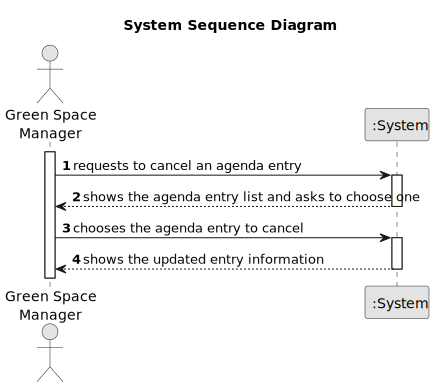

# US025 - Cancel an entry in the Agenda

## 1. Requirements Engineering

### 1.1. User Story Description

As a GSM, I want to Cancel an entry in the Agenda.

### 1.2. Customer Specifications and Clarifications

**From the specifications document:**

> Skills are what enables a collaborator to do a certain task

**From the client clarifications:**

> **Question:** When a task is cancelled, is it possible to put it back on the agenda again later?
>
> **Answer:** Yes

> **Question:** When we cancel a task, do we move it again to the To-Do List?
>
> **Answer:** No

### 1.3. Acceptance Criteria

* **AC1:** A canceled task should not be deleted but rather change its state.

### 1.4. Found out Dependencies

* There is a dependency on "US020 - As a GSM, I want to register a green space (garden, medium-sized park, or large park) and its respective area." - there has to be at least one green space registered to associate entries in the Agenda.
* There is a dependency on "US021 - As a GSM, I want to add a new entry to the To-Do List." - there has to be an entry in the To-Do List to be associated with the Agenda.
* There is a dependency on "US022 - As a GSM, I want to add a new entry to the Agenda." - the new entry must be associated with a registered green space and must exist in the To-Do List.

### 1.5 Input and Output Data

**Input Data:**

* Typed data:
    * 

**Output Data:**

* (In)Success of the operation
* The updated entry information

### 1.6. System Sequence Diagram (SSD)

### 1.7 Other Relevant Remarks

* 