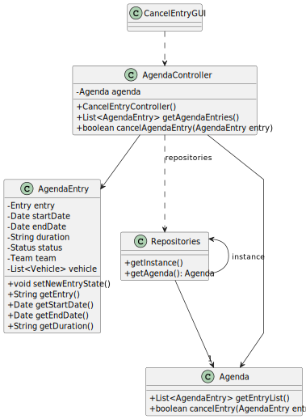

# US025 - Cancel an entry in the agenda

## 3. Design - User Story Realization

### 3.1. Rationale

| Interaction ID | Question: Which class is responsible for...                   | Answer            | Justification (with patterns)                                                                                 |
|:---------------|:--------------------------------------------------------------|:------------------|:--------------------------------------------------------------------------------------------------------------|
| Step 1         | ... interacting with the actor?                               | CancelUI          | Pure Fabrication: The is no reason to assign this responsability to nay existing class in the Domain Model.   |
|                | ... coordinating the US?                                      | EntryController   | Controller                                                                                                    |
| Step 2         | ... requesting the data?                                      | CancelUI          | Pure Fabrication: The UI class is responsible for capturing user input.                                       |
| Step 3         | ... receiving the data?                                       | CancelUI          | Pure Fabrication: The UI class is responsible for capturing user input.                                       |
|                | ... getting entry repository?                                 | Repositories      | Repository                                                                                                    |
|                | ... getting all the agenda entries and return them as a list? | EntryRepository   | Repository                                                                                                    |
|                | ... showing the entries available for selection?              | CancelUI          | Pure Fabrication: The UI class is responsible for capturing user input.                                       |
| Step 4         | ... handling the user selecting an entry?                     | CancelUI          | Pure Fabrication: The UI class is responsible for capturing user input.                                       |
| Step 5         | ... showing the confirmation info?                            | CancelUI          | Pure Fabrication: The UI class is responsible for capturing user input.                                       |
|                | ... validating all data (local validation)?                   | Entry             | Information Expert: The Entry class has the information about the entry and is responsible for validating it. |
|                | ... validating all data (global validation)?                  | EntryRepository   | Repository                                                                                                    | 
|                | ... saving the new status of the agenda entry?                | EntryRepository   | Repository                                                                                                    |
|                | ... notifying the team?                                       | TeamRepository    | Repository                                                                                                    | 
| Step 6         | ... informing of operation success?                           | CancelUI          | Pure Fabrication: The UI class is responsible for capturing user input.                                                                                            | 

### Systematization ##

According to the taken rationale, the conceptual classes promoted to software classes are:

* Entry
* Agenda

Other software classes (i.e. Pure Fabrication) identified:

* Repositories
* CancelUI
* EntryController
* EntryRepository
* TeamRepository

## 3.2. Sequence Diagram (SD)

*Note that SSD - Alternative Two is adopted.*

### Full Diagram

This diagram shows the full sequence of interactions between the classes involved in the realization of this user story.

## 3.3. Class Diagram (CD)

