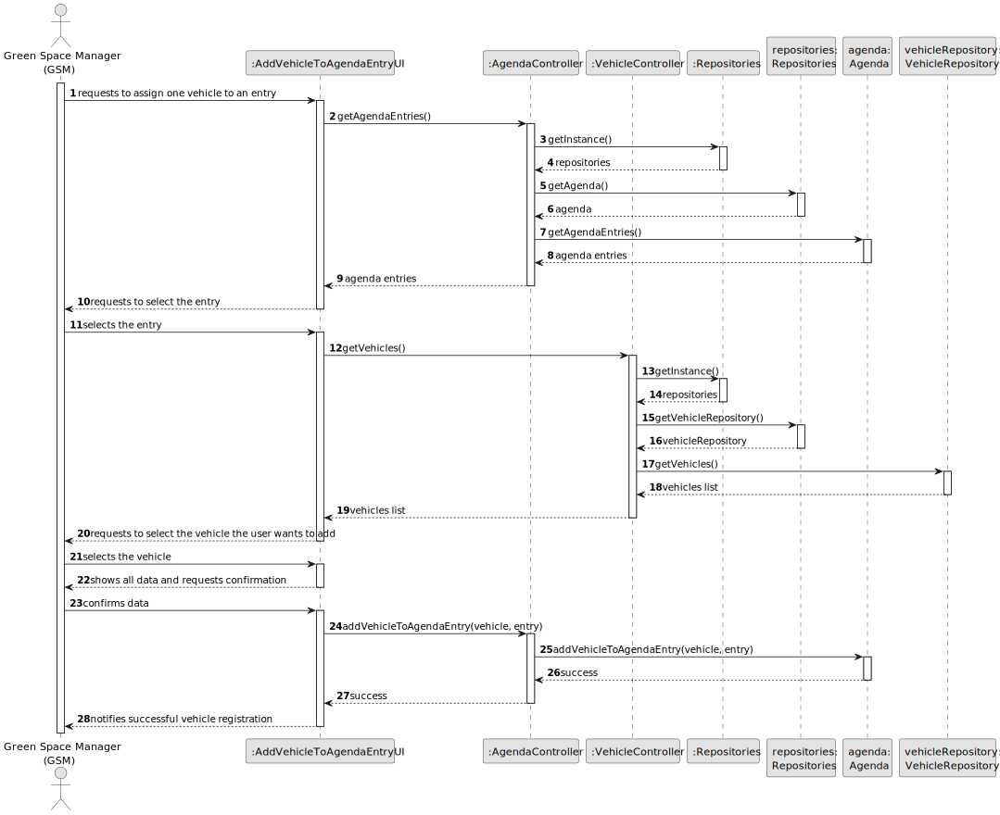

# US026 - Assign a vehicle to an entry in the agenda

## 3. Design - User Story Realization

### 3.1. Rationale

| Interaction ID                                               | Question: Which class is responsible for...       | Answer                                   | Justification (with patterns)                                                                                 |
|:-------------------------------------------------------------|:--------------------------------------------------|:-----------------------------------------|:--------------------------------------------------------------------------------------------------------------|
| Step 1: Requests to assign one vehicle to an entry		         | 	... interacting with the user?                   | AddVehicleToAgendaEntryUI                | Pure Fabrication: there is no reason to assign this responsibility to any existing class in the Domain Model. |
| 			  		                                                      | ... coordinating the US?                          | AgendaController and VehicleController   | Controller.                                                                                                   |
|                                                              | ... getting the list of agenda entries?           | AgendaController                         | IE: Its the controller with access to the agenda which stores the agenda list.                                |
| Step 2: Requests to select the entry 		                      | ... interacting with the user?                    | AddVehicleToAgendaEntryUI                | IE: Responsible for interacting with the user.                                                                |
| Step 3: Selects the entry		                                  | ... temporarily keeping the typed data?           | AddVehicleToAgendaEntryUI                | IE: Responsible for keeping the selected data temporarily.                                                    |
|                                                              | ... getting the list of vehicle entries?          | VehicleController                        | IE: Its the controller with access to the vehicle repository which stores the vehicle list.                   |  
| Step 4: Requests to select the vehicle the user wants to add | ... interacting with the user?                    | AddVehicleToAgendaEntryUI                | IE: Responsible for interacting with the user.                                                                |
| Step 5: Selects the vehicle                                  | ... temporarily keeping the data?                 | AddVehicleToAgendaEntryUI                | IE: Responsible for storing the selected data temporarily.                                                    |
| Step 6: Shows all data and requests confirmation             | ... showing all data and requesting confirmation? | AddVehicleToAgendaEntryUI                | IE: Temporarily knows inputted data until user confirmation. |
| Step 7: Confirms data                                        | ... saving all the data?                          | AgendaController                         | IE:  Responsible for associating vehicles to agenda entries. |
| Step 8: Notifies successful vehicle registration             | ... informing operation success?                  | AddVehicleToAgendaEntryUI                | IE: Responsible for interacting with user. |

### Systematization ##

According to the taken rationale, the conceptual classes promoted to software classes are:

* AgendaController
* VehicleController
* AgendaRepository
* VehicleRepository

Other software classes (i.e. Pure Fabrication) identified:

* AddVehicleToAgendaEntryUI

## 3.2. Sequence Diagram (SD)

### Full Diagram

This diagram shows the full sequence of interactions between the classes involved in the realization of this user story.

### Split Diagrams

N/A

## 3.3. Class Diagram (CD)

