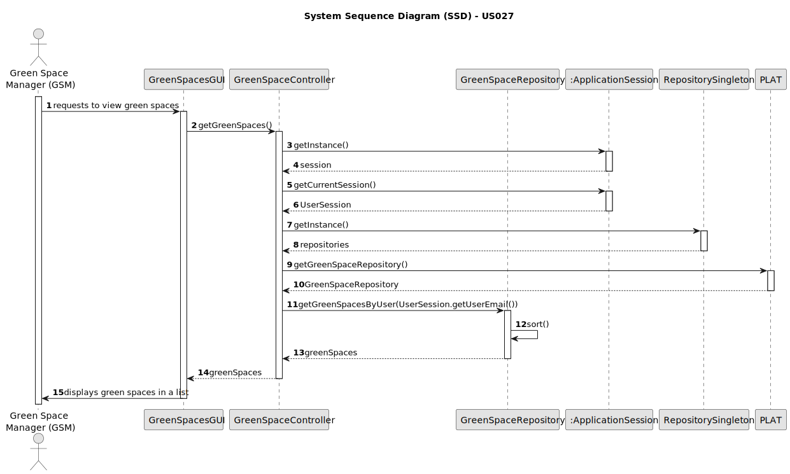

# US027 - List all green spaces managed by a GSM.

## 3. Design - User Story Realization

### 3.1. Rationale

_**Note that SSD - Alternative One is adopted.**_

| Interaction ID | Question: Which class is responsible for...           | Answer                 | Justification (with patterns)                                                                                 |
|:--------------|:------------------------------------------------------|:-----------------------|:--------------------------------------------------------------------------------------------------------------|
| Step 1  		    | 	... interacting with the actor?                      | GreenSpacesGUI         | Pure Fabrication: there is no reason to assign this responsibility to any existing class in the Domain Model. |
| 			  	        | 	... coordinating the US?                             | GreenSpaceController   | Controller                                                                                                    |
| Step 2  		    | 	... requesting data?                                 | GreenSpaceController   | Information Expert                                                                                              |
| Step 3			     | ... receiving the data?                               | GreenSpaceController   | Information Expert                                                                                              |
| 			  		       | ... get the green space repository?					            | Repositories           | Information Expert, High cohesion, Low coupling                                                               |
| 			  		       | ... get all the green spaces and return them as a list? | GreenSpaceRepository   | Information Expert                                                                                            |
| Step 4  		    | 	...showing the green spaces to select?						           | GreenSpacesGUI         | Pure Fabrication                                                                                              |
| Step 5  		    | ... handling the user selecting a green space?         | GreenSpacesGUI         | Pure Fabrication                                                                                              |
| Step 6  		    | 	...show the confirmation info?                       | GreenSpacesGUI         | Pure Fabrication                                                                                              |
| Step 7  		    | 	... instantiating a new To-Do List Entry?            | GreenSpaceController   | Creator, High cohesion, Low coupling                                                                          |
| 		            | 	... validating all data (local validation)?          | GreenSpace             | Information Expert                                                                                            |
| 			  		       | 	... validating all data (global validation)?         | GreenSpaceRepository   | Information Expert                                                                                     |
| 			  		       | 	... saving the To-Do List Entry?                     | GreenSpaceRepository   | Information Expert                                                                                       |
|               | ... having all the repositories?                      | Repositories           |  Information Expert, High cohesion, Low coupling                                                                                                        |
| Step 8  		    | 	... informing operation success?                     | GreenSpacesGUI         | IE: is responsible for user interactions.                                                                     |

### Systematization ##

According to the taken rationale, the conceptual classes promoted to software classes are:

* Green Space Manager
* Green Space

Other software classes (i.e. Pure Fabrication) identified:

* GreenSpacesGUI
* GreenSpaceController
* GreenSpaceRepository
* Repositories

## 3.2. Sequence Diagram (SD)

### Full Diagram

This diagram shows the full sequence of interactions between the classes involved in the realization of this user story.

## 3.3. Class Diagram (CD)

