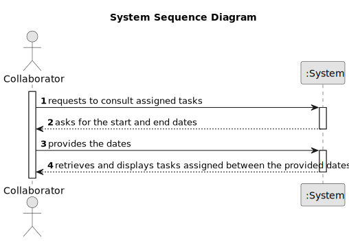

# US028 - As a Collaborator, I wish to consult the tasks assigned to me between two dates.

## 1. Requirements Engineering

### 1.1. User Story Description

As a Collaborator, I want to consult tasks assigned to me between two dates.

### 1.2. Customer Specifications and Clarifications

**From the specifications document:**

> Skills are what enables a collaborator to do a certain task

**From the client clarifications:**

> **Question:** Dear client, I didn't end to understand a question answered here. A collaborator could have assigned at the same time different tasks from different teams, isnt it? Apart, which atributes has a task ( maybe something like: name, frequency, creation_date, lenght, status)? Which id do you want (I think name is not a good idea)? Which status could a task have?
>
> **Answer:** No, in a specific period (for instance during a week) a collaborator just belongs to team. But if you consider a wider period you may find different teams to which a collaborator belonged.
In this project no distinction will be made between recorrent/occasional tasks; I suppose that the identification is a combination of Name, Date and Local, like Prunning Trees at 20/05/2024 in Parque da Cidade.

> **Question:** Dear client,
could a task belong to different teams and collaborators? I mean, if the status, degree of urgency and expect duration belong to an entry of the to do list and the task is something generic that can be reuse, or if the task could belong only to one collaborator, and for another you have to create another one.
>
> **Answer:** No. Maybe a distintion should be made between type of task and a task.
Task type is "Prunning trees", a specific task is "Prunning trees" in specific park in a specific date.

> **Question:** In the US28, the tasks consulted will be the ones that were assigned to the team/teams that collaborator is in, right?
> 
>Why do we need to show a list of green spaces? Are we assuming that one collaborator could work in 2 different parks?
>
>What should be the output? The description of the task + the team (if the first sentence is correct)?
Thank you.
>
> **Answer:** 1)right 
>
> 2)Yes, a collaborator can work in multiples green spaces 
>
> 3)Development teams can decide about the UX/UI related aspects of the solution.

> **Question:** Why is the expected duration repeted in Task, To-Do-List Entry and Agenda entry. Is enough to give this atribute only to task?
>
>Apart, is correct to put the status in Task, or should it belongs to Agenda's entry only.
Do we need to create first a task and them asociate it with a To-Do-List Entry or the creation of the task is the same of the creation of a To-Do-List Entry.
>
>Finally, an Agenda's entry is asociated with a team and then the team decides to which member/members belongs the task? Do we asociate a collaborator with the Agenda Entry, To-Do-List Entry or Task?
Thank you
>
> **Answer:** you can have a generic task like "Prunning Trees" and you will have Entries in the To-Do List that relates to a task, park, urgency, expected duration.
>
>I'm not concerned how you will store/keep the information needed to provide the funcionality, it's not a Client concern ;-)
>
>Finally, the GSM ou HRM can generate teams and then assign a team to an entry in agenda. The collaborator is member of a team (please keep in consideration that the relation collaborator memberOf team should be valid during a specific time interval).

> **Question:** Do collaborators log in with a password (created by the respective manager when creating the collaborator), or with other information like the BI number or the TaxPayer?
>
> **Answer:** One can use email or taxpayer number.

> **Question:** While consulting tasks, how specific should be data presented to collaborator? Should it be all entries from the agenda with collaborator's team assigned or generic tasks that these entries refer to? As there is agenda entry, to-do list entry and task.
>
> **Answer:**
A "generic task" is something like "task type" or "template task", for instance "Prunning Trees".
When a GSM decides to insert a entry in the To-Do list, he selects a generic task, selects a park, defines the expected duration and the urgency.
Later, that To-do List entry will originate an Entry in the Agenda with a starting date/time. That Entry can be managed due to actions/events that happens, hence the Entry can be Canceled, Postponed or Completed.

>  **Question:** For a new entry in the agenda, if we assign it to a team, is this assigned to all members of the group? This could be contradictory because maybe one of the collaborators of the team doesn't have the skill to perform this task.
>
> **Answer:** It depends in the granularity of the task.
> 
> If the task is Prunning Trees, besides the ones who will prune the tree, the team will need need someone who transports persons and machinery; someone who operates some kind of machinery; maybe a coordinator.

> **Question:** When a collaborator is registered, they are given an account with the registered email and a password? This allows them to log in and view their tasks later on. What should be the password for this collaborator's account?
>
> **Answer:** Yes, it make sense.
> 
>About the password, not important in this stage of the project.

> **Question:** Dear client, why is the expected duration repeted in Task, To-Do-List Entry and Agenda entry. Is enough to give this atribute only to task?
>
>Apart, is correct to put the status in Task, or should it belongs to Agenda's entry only.
>
>Do we need to create first a task and them asociate it with a To-Do-List Entry or the creation of the task is the same of the creation of a To-Do-List Entry.
>
>Finally, an Agenda's entry is asociated with a team and then the team decides to which member/members belongs the task? Do we asociate a collaborator with the Agenda Entry, To-Do-List Entry or Task?
>
> **Answer:** The business flow has already been explained in advance; Data structures and their attributes (such as states) are a technical aspect that is not within the scope of the client's competences.

### 1.3. Acceptance Criteria

* **AC1:** All required fields must be filled in.
* **AC2:** The collaborator must exist in the system.
* **AC3** The collaborator must not have the skill already.
* **AC4:** The skill must exist in the system.

### 1.4. Found out Dependencies

* There is a dependency on "US003 - As an HRM, I want to register a collaborator with a job and fundamental
  characteristics." - there has to be at least one collaborator to be assigned a skill
* There is a dependency on "US001 - As an HRM, I want to register skills that a collaborator may have" - there has to be at least one skill to be assigned to a collaborator

### 1.5 Input and Output Data

**Input Data:**

* Typed data:
    * The collaborator
    * The skill

**Output Data:**

* (In)Success of the operation
* The updated skills of the collaborator

### 1.6. System Sequence Diagram (SSD)

### 1.7 Other Relevant Remarks

* The user can always choose a different person to add the skill in case he makes a mistake