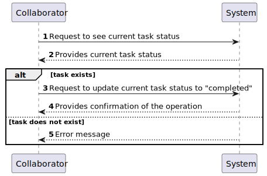

# US004 - Add a skill to a collaborator

## 1. Requirements Engineering

### 1.1. User Story Description

As a HRM, I want to add a skill to a collaborator.

### 1.2. Customer Specifications and Clarifications

**From the specifications document:**

> Skills are what enables a collaborator to do a certain task

**From the client clarifications:**

> **Question:** Can an employee record more than one completed task at a time?
>
> **Answer:** It's a matter of UX/UI, each dev team can decide about it.

> **Question:** When a collaborator records a task, it should be asked for any observations regarding the completed task?
>
> **Answer:** Maybe if optional, not mandatory.

> **Question:** The collaborator should be able to change the status of any task or only tasks assigned to him?
>
> **Answer:** yes.

> **Question:** Can a collaborator mark a task as "done" only if it is in the "planned" status?
>
> **Answer:** It depends in the status set your team decide to have/use. But if you consider only status refered in the text and in the forum my answer would be, yes, just the "Planned" status can be changed to "Done".

> **Question:** Do collaborators log in with a password (created by the respective manager when creating the collaborator), or with other information like the BI number or the TaxPayer?
>
> **Answer:** One can use email or taxpayer number.

### 1.3. Acceptance Criteria

* **AC1:** All required fields must be filled in.
* **AC2:** The collaborator must exist in the system.
* **AC3** The collaborator must not have the skill already.
* **AC4:** The skill must exist in the system.

### 1.4. Found out Dependencies

* 
*  
### 1.5 Input and Output Data

**Input Data:**

* Typed data:
    * 
    * 
**Output Data:**

* 
* 

### 1.6. System Sequence Diagram (SSD)

### 1.7 Other Relevant Remarks

* 